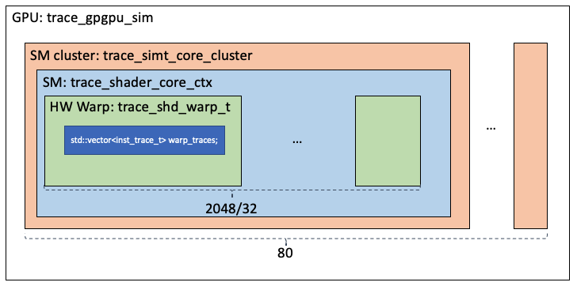

# Architecture Hierarchy

The GPU is modeled as follows. The class `trace_simt_core_cluster` models the whole GPU. Its member, `trace_gpgpu_sim->m_cluster`, is a vector of `trace_simt_core_cluster` objects. Each object models an SM cluster. In each cluster, there is memeber, `trace_simt_core_cluster->m_core`, that models the SM cores in this cluster. Each SM core is modeled with an object of `trace_shader_core_ctx`. Within the SM core, there is a set of hardware warps, `trace_shader_core_ctx->m_warp`, modeled by class `trace_shd_warp_t`. The number of hardware warps in each SM equals to the maximum number of threads (2048 for V100) divided by the warp size 32.
