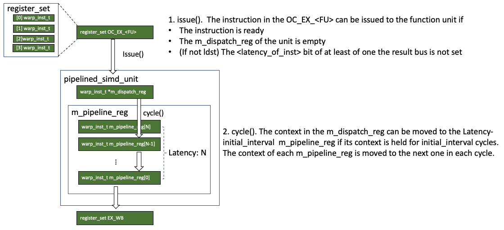

# Execute



This note covers the `execute()` in the SM core's pipeline.
```c++
// shader_core_ctx::cycle()
execute();
```

## Function Units
This class and its child classes model all the SIMD units in the SM core like the single-precision units and load-store units.

### Definition
Here we use the spectialized unit as an example. Other units are more or less same, except that ldst unit may be different.
```c++
class simd_function_unit {
 public:
  simd_function_unit(const shader_core_config *config);
  ~simd_function_unit() { delete m_dispatch_reg; }

  // modifiers
  virtual void issue(register_set &source_reg) {
    // there is a m_dispatch_reg used to keep the input warp_inst_t
    source_reg.move_out_to(m_dispatch_reg);
    occupied.set(m_dispatch_reg->latency);
  }
  virtual void cycle() = 0;
  virtual void active_lanes_in_pipeline() = 0;

  // accessors
  virtual unsigned clock_multiplier() const { return 1; }
  virtual bool can_issue(const warp_inst_t &inst) const {
    return m_dispatch_reg->empty() && !occupied.test(inst.latency);
  }
  virtual bool stallable() const = 0;
  const char *get_name() { return m_name.c_str(); }

 protected:
  std::string m_name;
  const shader_core_config *m_config;
  warp_inst_t *m_dispatch_reg;
  static const unsigned MAX_ALU_LATENCY = 512;
  std::bitset<MAX_ALU_LATENCY> occupied;
};


class pipelined_simd_unit : public simd_function_unit {
 public:
  pipelined_simd_unit(register_set *result_port,
                      const shader_core_config *config, unsigned max_latency,
                      shader_core_ctx *core);

  // modifiers
  virtual void cycle();
  virtual void issue(register_set &source_reg);
  virtual unsigned get_active_lanes_in_pipeline();

  virtual void active_lanes_in_pipeline() = 0;
  /*
      virtual void issue( register_set& source_reg )
      {
          //move_warp(m_dispatch_reg,source_reg);
          //source_reg.move_out_to(m_dispatch_reg);
          simd_function_unit::issue(source_reg);
      }
  */
  // accessors
  virtual bool stallable() const { return false; }
  virtual bool can_issue(const warp_inst_t &inst) const {
    return simd_function_unit::can_issue(inst);
  }
  virtual void print(FILE *fp) const {
    simd_function_unit::print(fp);
    for (int s = m_pipeline_depth - 1; s >= 0; s--) {
      if (!m_pipeline_reg[s]->empty()) {
        fprintf(fp, "      %s[%2d] ", m_name.c_str(), s);
        m_pipeline_reg[s]->print(fp);
      }
    }
  }

 protected:
  unsigned m_pipeline_depth;
  warp_inst_t **m_pipeline_reg;
  register_set *m_result_port;
  class shader_core_ctx *m_core;

  unsigned active_insts_in_pipeline;
};

class specialized_unit : public pipelined_simd_unit {
 public:
  specialized_unit(register_set *result_port, const shader_core_config *config,
                   shader_core_ctx *core, unsigned supported_op,
                   char *unit_name, unsigned latency);
  virtual bool can_issue(const warp_inst_t &inst) const {
    if (inst.op != m_supported_op) {
      return false;
    }
    return pipelined_simd_unit::can_issue(inst);
  }
  virtual void active_lanes_in_pipeline();
  virtual void issue(register_set &source_reg);

 private:
  unsigned m_supported_op;
};
```

The unit has several important members.
* `warp_inst_t *m_dispatch_reg;` when a instruction is issued from the OC_EX register set to the function unit, it is saved in the dispatch register.
* `std::bitset<MAX_ALU_LATENCY> occupied;` A bitset that tracks which pipeline stage is occupied. 
* `warp_inst_t **m_pipeline_reg;` a set of intermediate pipeline registers within the function unit.
* `register_set *m_result_port;` output port. It is usually the EX_WB pipeline register set.
* `unsigned m_supported_op;` the opcode supported by the unit.

### Init()

The configuration of the unit is read from the configuration file. Then the function units are created in the `shader_core_ctx::create_exec_pipeline()` function.
```c++
// shader_core_config::init()
sscanf(specialized_unit_string[i], "%u,%u,%u,%u,%u,%s", &enabled,
       &sparam.num_units, &sparam.latency, &sparam.id_oc_spec_reg_width,
       &sparam.oc_ex_spec_reg_width, sparam.name);

// trace.config
-specialized_unit_3 1,4,8,4,4,TENSOR;
// enabled = 1
// num_units = 4
// latency = 8
// ID_OC_width = 4
// OC_EX_width = 4
// name: TENSOR


// shader_core_ctx::create_exec_pipeline()
for (int j = 0; j < m_config->m_specialized_unit.size(); j++) {
  for (unsigned k = 0; k < m_config->m_specialized_unit[j].num_units; k++) {
    m_fu.push_back(new specialized_unit(
      &m_pipeline_reg[EX_WB], m_config, this, SPEC_UNIT_START_ID + j,
      m_config->m_specialized_unit[j].name,
      m_config->m_specialized_unit[j].latency));
    m_dispatch_port.push_back(m_config->m_specialized_unit[j].ID_OC_SPEC_ID);
    m_issue_port.push_back(m_config->m_specialized_unit[j].OC_EX_SPEC_ID);
  }
}

// result_port: m_pipeline_reg[EX_WB]
// config: m_config
// core: core
// supported_op: SPEC_UNIT_START_ID + j
// unit_name: m_specialized_unit[j].name
// latency: m_specialized_unit[j].latency

specialized_unit::specialized_unit(register_set *result_port,
                                   const shader_core_config *config,
                                   shader_core_ctx *core, unsigned supported_op,
                                   char *unit_name, unsigned latency)
    : pipelined_simd_unit(result_port, config, latency, core) {
  // get the unit name and the supported op
  m_name = unit_name;
  m_supported_op = supported_op;
}

pipelined_simd_unit::pipelined_simd_unit(register_set *result_port,
                                         const shader_core_config *config,
                                         unsigned max_latency,
                                         shader_core_ctx *core)
    : simd_function_unit(config) {
  
  // m_result_prot is [EX_WB]
  m_result_port = result_port;
  // latency: m_specialized_unit[j].latency
  m_pipeline_depth = max_latency;
  // a list of pipeline registers
  m_pipeline_reg = new warp_inst_t *[m_pipeline_depth];
  // instancite the pipeline registers
  for (unsigned i = 0; i < m_pipeline_depth; i++)
    m_pipeline_reg[i] = new warp_inst_t(config);
  // attach the core 
  m_core = core;
  active_insts_in_pipeline = 0;
}

simd_function_unit::simd_function_unit(const shader_core_config *config) {
  // the input dispatch register
  m_config = config;
  m_dispatch_reg = new warp_inst_t(config);
}
```

### cycle()
This function is called `simd_function_unit::clock_multiplier` times each cycle, which is usually 1.
```c++
void pipelined_simd_unit::cycle() {
  // pipeline reg 0 is not empty
  if (!m_pipeline_reg[0]->empty()) {
    // put m_pipeline_reg[0] to the EX_WB reg
    m_pipeline_reg[0]-> m_result_port
    m_result_port->move_in(m_pipeline_reg[0]);
    active_insts_in_pipeline--;
  }
  // move warp_inst_t through out the pipeline
  if (active_insts_in_pipeline) {
    for (unsigned stage = 0; (stage + 1) < m_pipeline_depth; stage++)
      move_warp(m_pipeline_reg[stage], m_pipeline_reg[stage + 1]);
  }
  // If the dispatch_reg is not empty
  /*
  	cycles = initiation_interval;
    bool dispatch_delay() {
      if (cycles > 0) cycles--;
      return cycles > 0;
    }
  */
  if (!m_dispatch_reg->empty()) {
    // If not dispatch_delay
    if (!m_dispatch_reg->dispatch_delay()) {
      // during dispatch delay, the warp is still moving through the pipeline, 
      // though the dispatch_reg cannot be changed
      int start_stage =
          m_dispatch_reg->latency - m_dispatch_reg->initiation_interval;
      move_warp(m_pipeline_reg[start_stage], m_dispatch_reg);
      active_insts_in_pipeline++;
    }
  }
  occupied >>= 1;
}
```
It does the following things
* If the dispatch register is not empty, and dispatch delay is finished, the context is moved from the dispatch register to the `dispatch delay` stage of pipeline.
* Move instructions across the inner pipeline registers
* If the last inner pipeline register is not empty, issue it to the output port (usually EX_WB pipeline register set)

**Dispatch Delay**
Let's talk more about dispatch delay. 
In the `trace.config` file of V100, we have
```
#tensor unit
-specialized_unit_3 1,4,8,4,4,TENSOR
-trace_opcode_latency_initiation_spec_op_3 8,4
```
In the second line, it has two values: 8 and 4. The former one is <mark>initiation_interval</mark> and the latter one is <mark>latency</mark>. The `initiation_interval` is the dispatch delay and the `latency` is the number of pipeline stages in the pipeline. 

In another word, an instruction can be issued to the function unit every `initiation_interval`. It takes `latency` cycles for an instruction travel through the function unit.

The `start_stage` here 
```c++
int start_stage = m_dispatch_reg->latency - m_dispatch_reg->initiation_interval;
```
suggests that the instruction moves through the pipeline stages every cycle, but the context of dispatch unit cannot change in `initiation_interval` cycles.

## Result Bus
The SM core has a set of result buses defined as follows
```c++
// shader_core_ctx
std::vector<std::bitset<MAX_ALU_LATENCY> *> m_result_bus;

// shader_core_ctx::create_exec_pipeline()
num_result_bus = m_config->pipe_widths[EX_WB];
for (unsigned i = 0; i < num_result_bus; i++) {
this->m_result_bus.push_back(new std::bitset<MAX_ALU_LATENCY>());
}
```
Each result bus is simply a bit set. The number of result buses equal to the number of EX_WB pipeline registers.

### shader_core_ctx::test_res_bus()
This function locates a free slot in all the result buses (the slot is free if its bit is not set)

```c++
int shader_core_ctx::test_res_bus(int latency) {
  for (unsigned i = 0; i < num_result_bus; i++) {
    if (!m_result_bus[i]->test(latency)) {
      return i;
    }
  }
  return -1;
}
```

## execute()
Then let's see the `execute()` stage of the SM core.
```c++
// shader_core_ctx::cycle()
execute();

// shader_core_ctx
std::vector<simd_function_unit *> m_fu;

void shader_core_ctx::execute() {
  // result buses:: result buses move
  for (unsigned i = 0; i < num_result_bus; i++) {
    *(m_result_bus[i]) >>= 1;
  }
  
  for (unsigned n = 0; n < m_num_function_units; n++) {
    // clock multiplier: some units may operate under higher cycle rate.
    unsigned multiplier = m_fu[n]->clock_multiplier();
    // cycle 
    for (unsigned c = 0; c < multiplier; c++) m_fu[n]->cycle();
    // active_lanes_in_pipeline: some stats
    m_fu[n]->active_lanes_in_pipeline();
    // issue_port is OC_EX
    unsigned issue_port = m_issue_port[n];
    // get the real issue port
    register_set &issue_inst = m_pipeline_reg[issue_port];
    // find a ready slot in OC_EX_<FU>
    warp_inst_t **ready_reg = issue_inst.get_ready();
    
    /*
        virtual bool can_issue(const warp_inst_t &inst) const {
            return m_dispatch_reg->empty() && !occupied.test(inst.latency);
        }   

        // m_dispatch_reg->latency: latency of the instruction
        virtual void issue(register_set &source_reg) {
            source_reg.move_out_to(m_dispatch_reg);
            occupied.set(m_dispatch_reg->latency);
        }
      
      // pipelined_simd_unit::cycle()
      occupied >>= 1;
    */
    if (issue_inst.has_ready() && m_fu[n]->can_issue(**ready_reg)) {
      // pipelined_simd_unit
      // virtual bool stallable() const { return false; }
      
      // ldst_unit
      // virtual bool stallable() const { return true; }
      bool schedule_wb_now = !m_fu[n]->stallable();
      int resbus = -1;
      // if not ldst unit
      if (schedule_wb_now &&
          // find a result bus that at latency it is available
          (resbus = test_res_bus((*ready_reg)->latency)) != -1) {
        assert((*ready_reg)->latency < MAX_ALU_LATENCY);
        // set latency bit of the result bus
        m_result_bus[resbus]->set((*ready_reg)->latency);
        m_fu[n]->issue(issue_inst);
      } 
      // if it is ldst unit
      else if (!schedule_wb_now) {
        m_fu[n]->issue(issue_inst);
      } else {
        // stall issue (cannot reserve result bus)
      }
    }
  }
}
```

The above code has two parts. In the first part, all the bits in the result buses are shift left, which simulates a cycle in the result bus. 

In the second part, all the function units are traversed. For each function unit, its `cycle()` is called. Then, get the OC_EX port of the function unit (`issue_inst`), and get the `warp_inst_t` to be issued to the function unit from the port (`ready_reg`). 

The instruction can be issued to the function unit if
* The OC_EX port has a ready instruction
* The function unit can issue a new instruction
    * Its dispatch register `m_dispatch_reg` is empty, and the `inst.latency` bit of the `occupied` is not set. 

If the previous two conditions are satisfied, the instruction will be issued if
* For ldst unit: it can be issued
* For others:
    * The `inst.latency` bit is not set in at least one result bus.

When issuing an instruction to the function unit
* For non-ldst units:
    * Set the `inst.latency` bit of the selected result bus
* For all units
    * Move the instruction from the OC_EX port to the dispatch register
    * Set the `inst.latency` bit of the `occupied`