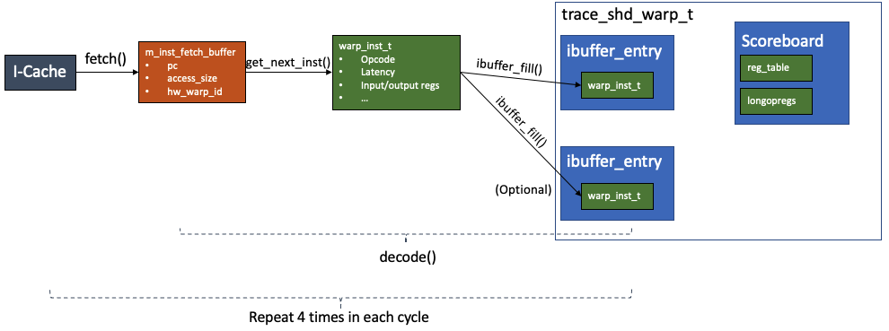
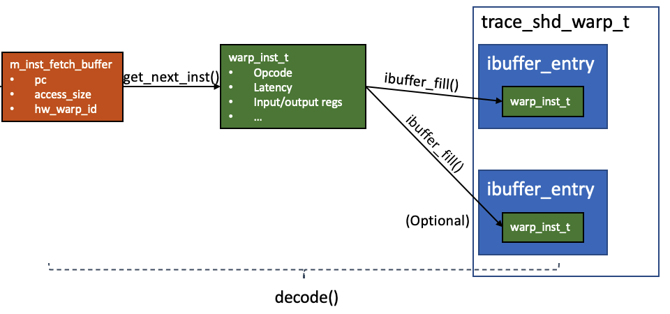

# Instruction Decode (ID)


In this part of the note covers the `fetch()` and `decode()` as follows
```c++
// shader_core_ctx::cycle()
for (int i = 0; i < m_config->inst_fetch_throughput; ++i) {
    decode();
    fetch();
}

```
In each `fetch()` step, the `m_inst_fetch_buffer` issues instruction memory fetch request and collect the fetched instructions from L1 instruction cache. In each `decode()` step, the context in the `m_inst_fetch_buffer` is decoded into an object of `warp_inst_t` and stored to the ibuffer of the corresponding hardware warp waiting to be issued by the scheduler.
***

## Instruction Fetch Buffer


The Instruction Fetch Buffer (`ifetch_buffer_t`) models the interface between the instruction cache (I-Cache) and the SM core. It is defined as follows
```c++
// shader_core_ctx
ifetch_buffer_t m_inst_fetch_buffer;

struct ifetch_buffer_t {
  ifetch_buffer_t() { m_valid = false; }

  ifetch_buffer_t(address_type pc, unsigned nbytes, unsigned warp_id) {
    m_valid = true;
    m_pc = pc;
    m_nbytes = nbytes;
    m_warp_id = warp_id;
  }

  bool m_valid;
  address_type m_pc;
  unsigned m_nbytes;
  unsigned m_warp_id;
};
```
It has a member `m_valid` that indicates whether the buffer has a valid instruction. It also records the warp id of the instruction in `m_warp_id`.

## fetch()

The `fetch()` function generates instruction memory request and collects the fetched instruction from L1 instruction cache. The fetched instruction is put into the instruction fetch buffer.

```c++
void shader_core_ctx::fetch() {
  // if the buffer is not valid
  if (!m_inst_fetch_buffer.m_valid) {
    // if there is an instruction ready in the instruction cache
    if (m_L1I->access_ready()) {
      // Something about instruction cache fetch
      mem_fetch *mf = m_L1I->next_access();
      m_warp[mf->get_wid()]->clear_imiss_pending();
      // The buffer includes three information
      // pc, size, and hw_warp_id
      m_inst_fetch_buffer =
          ifetch_buffer_t(m_warp[mf->get_wid()]->get_pc(),
                          mf->get_access_size(), mf->get_wid());
      // Now the context in the buffer is valid
      m_inst_fetch_buffer.m_valid = true;
      m_warp[mf->get_wid()]->set_last_fetch(m_gpu->gpu_sim_cycle);
      delete mf;
    } 
    // if there is not an instruction ready in the instruction cache
    else {
      // find an active warp with space in instruction buffer that is not
      // already waiting on a cache miss and get next 1-2 instructions from
      // i-cache...
      // Traverse all the hardware warps. Start from the last_warp_fetched
      for (unsigned i = 0; i < m_config->max_warps_per_shader; i++) {
        unsigned warp_id =
            (m_last_warp_fetched + 1 + i) % m_config->max_warps_per_shader;

        // Something check if this warp has finished executing and can be

        // this code fetches instructions from the i-cache or generates memory
        // if the warp is not functional_done, not waiting for instruction,
        // and its instruction buffer is empty
        if (!m_warp[warp_id]->functional_done() &&
            !m_warp[warp_id]->imiss_pending() &&
            m_warp[warp_id]->ibuffer_empty()) {
          address_type pc;
          pc = m_warp[warp_id]->get_pc();
          address_type ppc = pc + PROGRAM_MEM_START;
          unsigned nbytes = 16;
          unsigned offset_in_block =
              pc & (m_config->m_L1I_config.get_line_sz() - 1);
          if ((offset_in_block + nbytes) > m_config->m_L1I_config.get_line_sz())
            nbytes = (m_config->m_L1I_config.get_line_sz() - offset_in_block);
					
          // generate an instruction fetcg
          // TODO: replace with use of allocator
          // mem_fetch *mf = m_mem_fetch_allocator->alloc()
          mem_access_t acc(INST_ACC_R, ppc, nbytes, false, m_gpu->gpgpu_ctx);
          mem_fetch *mf = new mem_fetch(
              acc, NULL /*we don't have an instruction yet*/, READ_PACKET_SIZE,
              warp_id, m_sid, m_tpc, m_memory_config,
              m_gpu->gpu_tot_sim_cycle + m_gpu->gpu_sim_cycle);
          std::list<cache_event> events;
          
          // Check if the instruction is already in the instruction cache
          enum cache_request_status status;
          if (m_config->perfect_inst_const_cache)
            status = HIT;
          else
            status = m_L1I->access(
                (new_addr_type)ppc, mf,
                m_gpu->gpu_sim_cycle + m_gpu->gpu_tot_sim_cycle, events);

          if (status == MISS) {
            m_last_warp_fetched = warp_id;
            m_warp[warp_id]->set_imiss_pending();
            m_warp[warp_id]->set_last_fetch(m_gpu->gpu_sim_cycle);
          } else if (status == HIT) {
            m_last_warp_fetched = warp_id;
            m_inst_fetch_buffer = ifetch_buffer_t(pc, nbytes, warp_id);
            m_warp[warp_id]->set_last_fetch(m_gpu->gpu_sim_cycle);
            delete mf;
          } else {
            m_last_warp_fetched = warp_id;
            assert(status == RESERVATION_FAIL);
            delete mf;
          }
          break;
        }
      }
    }
  }

  m_L1I->cycle();
}
```
The logic is as follows:
* If the `m_inst_fetch_buffer` is empty (not valid)
  * If there is an instruction in the instruction cache (it is ready)
    * put the instruction into the `m_inst_fetch_buffer`
  * Otherwise if there isn't a ready instruction in the cache
    * traverse all the hardware warps (2048/32). If the warp is functioning, not waiting for instruction cache missing, and its instruction buffer is empty: generate a memory fetch request.
    * Check if the fetch can be directly obtained in the instruction cache.
      * If it is, put the instruction into `m_inst_fetch_buffer`
      * otherwise, the hardware warp is set to instruction cache missing state.
* Run the L1 instruction cache cycle.

## Instruction Buffer

```c++
// shd_warp_t
ibuffer_entry m_ibuffer[IBUFFER_SIZE];

// ibuffer_enrty
struct ibuffer_entry {
  ibuffer_entry() {
    m_valid = false;
    m_inst = NULL;
  }
  const warp_inst_t *m_inst;
  bool m_valid;
};

// shd_warp_t > ibuffer_fill
void ibuffer_fill(unsigned slot, const warp_inst_t *pI) {
  assert(slot < IBUFFER_SIZE);
  m_ibuffer[slot].m_inst = pI;
  m_ibuffer[slot].m_valid = true;
  m_next = 0;
}
```
Each hardware warp has 2 `m_ibuffer` that model the I-Buffer. The I-Buffer can hold an object of `warp_inst_t` decoded from the instruction fetch buffer. It also has a boolean member `m_valid` that indicates whether is holds a valid instruction. To fill the buffer, just put the `warp_inst_t` into the slot and set valid to true.

## Decode()

Each `m_inst_fetch_buffer` can contain one or two instructions. The context in the buffer is converted into one or to objects of type `(trace_)warp_inst_t`, one object per instruction. These objects are linked to the `m_inst` member in the ibuffer entry. Each hardware warp has two ibuffer entry.

The decode function is as follows

```c++
void shader_core_ctx::decode() {
  // If the m_inst_fetch_buffer contains an instruction
  if (m_inst_fetch_buffer.m_valid) {
    // decode 1 or 2 instructions and place them into ibuffer
    // get pc
    address_type pc = m_inst_fetch_buffer.m_pc;
    // get instruction
    const warp_inst_t *pI1 = get_next_inst(m_inst_fetch_buffer.m_warp_id, pc);
    // fill i-buffer
    m_warp[m_inst_fetch_buffer.m_warp_id]->ibuffer_fill(0, pI1);
    // increment the number of instructions in the pipeline
    m_warp[m_inst_fetch_buffer.m_warp_id]->inc_inst_in_pipeline();
    if (pI1) {
      // Some Stats
      const warp_inst_t *pI2 = get_next_inst(m_inst_fetch_buffer.m_warp_id, pc + pI1->isize);
      // If there is another instruction
      if (pI2) {
        m_warp[m_inst_fetch_buffer.m_warp_id]->ibuffer_fill(1, pI2);
        m_warp[m_inst_fetch_buffer.m_warp_id]->inc_inst_in_pipeline();
        // Some states
      }
    }
    // the buffer is empty
    m_inst_fetch_buffer.m_valid = false;
  }
}
```

There are several interesting functions: `get_next_inst`, `ibuffer_fill`, `inc_inst_in_pipeline`.
```c++
const warp_inst_t *trace_shader_core_ctx::get_next_inst(unsigned warp_id, address_type pc) {
  // read the inst from the traces
  // Just create a pointer
  trace_shd_warp_t *m_trace_warp =
      static_cast<trace_shd_warp_t *>(m_warp[warp_id]);
  // call the get_next_trace_inst of the hardware warp
  return m_trace_warp->get_next_trace_inst();
}

const trace_warp_inst_t *trace_shd_warp_t::get_next_trace_inst() {
  if (trace_pc < warp_traces.size()) {
    // create a new trace_warp_inst_t object
    trace_warp_inst_t *new_inst =
        new trace_warp_inst_t(get_shader()->get_config());
    // get the instruction from the trace
    new_inst->parse_from_trace_struct(
        warp_traces[trace_pc], m_kernel_info->OpcodeMap,
        m_kernel_info->m_tconfig, m_kernel_info->m_kernel_trace_info);
   	// increment pc
    trace_pc++;
    return new_inst;
  } else
    return NULL;
}
```
Notably, the `trace_pc` here is not the pc of the instruction, but pc (line number) to the trace. As the trace may repeat the same pc of instruction for several times when there are branches. The trace is converted into the type `trace_warp_inst_t` defined as follows
```c++
class trace_warp_inst_t : public warp_inst_t {
public:
  trace_warp_inst_t() {
    m_opcode = 0;
    should_do_atomic = false;
  }

  trace_warp_inst_t(const class core_config *config) : warp_inst_t(config) {
    m_opcode = 0;
    should_do_atomic = false;
  }

  bool parse_from_trace_struct(
      const inst_trace_t &trace,
      const std::unordered_map<std::string, OpcodeChar> *OpcodeMap,
      const class trace_config *tconfig,
      const class kernel_trace_t *kernel_trace_info);

private:
  unsigned m_opcode;
};
```
Let's see what information is extracted from the trace
```c++
bool trace_warp_inst_t::parse_from_trace_struct(
    const inst_trace_t &trace,
    const std::unordered_map<std::string, OpcodeChar> *OpcodeMap,
    const class trace_config *tconfig,
    const class kernel_trace_t *kernel_trace_info) {
  // fill the inst_t and warp_inst_t params

  // fill active mask
  active_mask_t active_mask = trace.mask;
  set_active(active_mask);

  // fill and initialize common params
  m_decoded = true;
  pc = (address_type)trace.m_pc;

  isize =
      16; // starting from MAXWELL isize=16 bytes (including the control bytes)
  
  // Set the input and output values to 0
  for (unsigned i = 0; i < MAX_OUTPUT_VALUES; i++) {
    out[i] = 0;
  }
  for (unsigned i = 0; i < MAX_INPUT_VALUES; i++) {
    in[i] = 0;
  }

  is_vectorin = 0;
  is_vectorout = 0;
  ar1 = 0;
  ar2 = 0;
  memory_op = no_memory_op;
  data_size = 0;
  op = ALU_OP;
  mem_op = NOT_TEX;

  // get the opcode
  std::vector<std::string> opcode_tokens = trace.get_opcode_tokens();
  std::string opcode1 = opcode_tokens[0];

  std::unordered_map<std::string, OpcodeChar>::const_iterator it =
      OpcodeMap->find(opcode1);
  if (it != OpcodeMap->end()) {
    m_opcode = it->second.opcode;
    op = (op_type)(it->second.opcode_category);
  } else {
    std::cout << "ERROR:  undefined instruction : " << trace.opcode
              << " Opcode: " << opcode1 << std::endl;
    assert(0 && "undefined instruction");
  }

  // fill regs information
  num_regs = trace.reg_srcs_num + trace.reg_dsts_num;
  num_operands = num_regs;
  outcount = trace.reg_dsts_num;
  
  // get the output registers
  for (unsigned m = 0; m < trace.reg_dsts_num; ++m) {
    out[m] = trace.reg_dest[m] + 1; // Increment by one because GPGPU-sim starts
                                    // from R1, while SASS starts from R0
    arch_reg.dst[m] = trace.reg_dest[m] + 1;
  }
	
  // get the input registers
  incount = trace.reg_srcs_num;
  for (unsigned m = 0; m < trace.reg_srcs_num; ++m) {
    in[m] = trace.reg_src[m] + 1; // Increment by one because GPGPU-sim starts
                                  // from R1, while SASS starts from R0
    arch_reg.src[m] = trace.reg_src[m] + 1;
  }
	
  // get latency and initiation latency
  // fill latency and initl
  tconfig->set_latency(op, latency, initiation_interval);

  // fill addresses
  if (trace.memadd_info != NULL) {
    data_size = trace.memadd_info->width;
    for (unsigned i = 0; i < warp_size(); ++i)
      set_addr(i, trace.memadd_info->addrs[i]);
  }

  // Something about handle special cases and fill memory space

  return true;
}
```
Basically, it records the basic information like Opcode, latency, latency, initiation_interval, input and output register lists.
