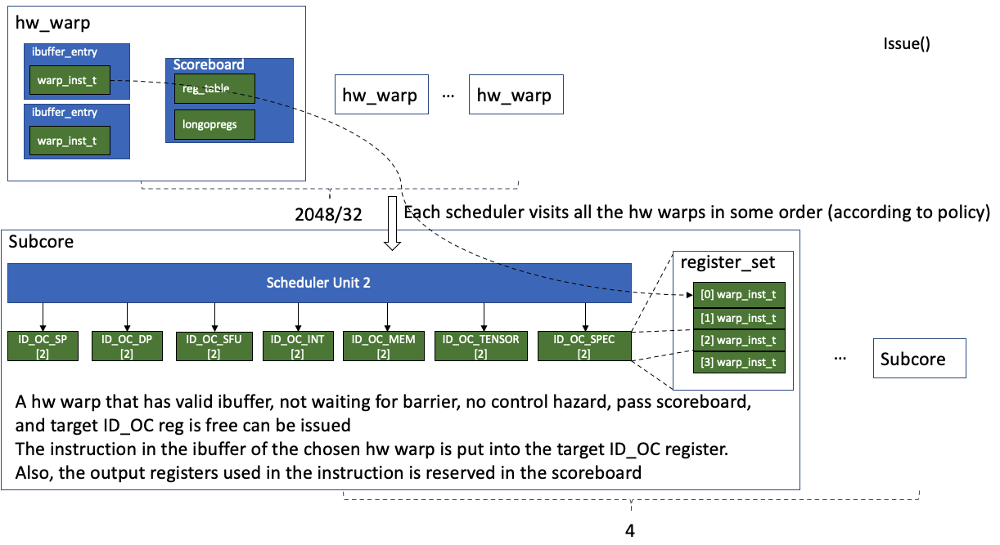

# Issue an Instruction

This corresponds to the `issue()` function in the SM core's pipeline.
```c++
// shader_core_ctx::cycle()
issue();
```
Basically, each scheduler unit in the SM core finds the hardware warp with a valid I-Buffer and highest priority. The priority of hardware warps are determined by which type of scheduler is used. To issue the instruction, the instruction must pass several checks including the barrier and the scoreboard. The issued instruction will be put into the slot in the ID_OC pipeline register set indexed by the scheduler id.

## Barriers
CUDA supports different kinds of barriers like `membar` in PTX and other warp-wide or block-wide sync barriers. They are modeled by `shd_warp_t::set_membar()` and `shd_warp_t::clear_membar()`, or the `barrier_ste_t m_barriers` in the `shader_core_ctx`.

## Scoreboard
The scoreboard is used to avoid read-after-write or write-after-write data hazards. In Accel-SIM, the scoreboard has two lists to reserve the destination registers of issued instructions. The first one, `reg_table`, tracks all the destination registers. The second one, `longopregs`, only tracks the destination registers of memory access.

Once an instruction of a warp is issued, its destination registers are reserved in the scoreboard. The reserved regsiters will be released in the writeback stage of the SM core's pipeline.

An instruction cannot be issued if its source registers or destination registers are reserved in the scoreboard of its hardware warp.

> In the SASS code, there are 6 barriers can be assigned to avoid data hazard. For instance, if a preceding instruction is marked with barrier 1, and a following instruction is maked with wait barrier 0x000010b, then the next instruction cannot be issued before the previous one is finished. However, this kind of barrier is not modeled in the Accel-SIM. 

> We guess that as each warp is allowed to access a large volumn of registers, it is too costly to track all the conflicts in the hardware. Therefore, the compiler resolves the data dependency between instructions, and mark the unavoidable hazards with one of the 6 barriers. The hardware only has to check the 6 barriers, which could be much simpler.

### Definition

The class `Scoreboard` is defined in `scoreboard.h` as follows
```c++
class Scoreboard {
 public:
  Scoreboard(unsigned sid, unsigned n_warps, class gpgpu_t *gpu);

  void reserveRegisters(const warp_inst_t *inst);
  void releaseRegisters(const warp_inst_t *inst);
  void releaseRegister(unsigned wid, unsigned regnum);

  bool checkCollision(unsigned wid, const inst_t *inst) const;
  bool pendingWrites(unsigned wid) const;
  void printContents() const;
  const bool islongop(unsigned warp_id, unsigned regnum);

 private:
  void reserveRegister(unsigned wid, unsigned regnum);
  int get_sid() const { return m_sid; }

  unsigned m_sid;

  // keeps track of pending writes to registers
  // indexed by warp id, reg_id => pending write count
  std::vector<std::set<unsigned> > reg_table;
  // Register that depend on a long operation (global, local or tex memory)
  std::vector<std::set<unsigned> > longopregs;

  class gpgpu_t *m_gpu;
};
```
The member `m_sid` indicates the SM core id. The `reg_table` reserves all the destination registers in the issued instructions that are not written back. The `longopregs` reserves all the destination registers in the issued memory access instructions that are not written back. It also provides functions like reserving or releasing registers from scoreboard and checking Collisions.

### Init()
The Scoreboard is initialized as follows
```c++
// shader_core_ctx::create_schedulers()
// m_sid: the SM core ID
m_scoreboard = new Scoreboard(m_sid, m_config->max_warps_per_shader, m_gpu);

// sid: SM id
// n_warps: 2048 / 32
Scoreboard::Scoreboard(unsigned sid, unsigned n_warps, class gpgpu_t* gpu)
    : longopregs() {
  m_sid = sid;
  // Initialize size of table
  reg_table.resize(n_warps);
  longopregs.resize(n_warps);

  m_gpu = gpu;
}
```
So each warp has a vector of  `std::set<unsigned>` for `reg_table` and  a vector of  `std::set<unsigned>` for `longopregs`. The length of the vector equals to the number of hardware warps. In another word, each hardware warp has its scoreboard.

### Reserve and Release Register
When an instruction is issued, its destination registers will be reserved in the scoreboard of teh corresponding hardware warp. When the instruction passes writeback, its destination registers are released.
```c++
// wid: hw warp id
// regnum: the register to reserve

void Scoreboard::reserveRegister(unsigned wid, unsigned regnum) {
  if (!(reg_table[wid].find(regnum) == reg_table[wid].end())) {
    printf(
        "Error: trying to reserve an already reserved register (sid=%d, "
        "wid=%d, regnum=%d).",
        m_sid, wid, regnum);
    abort();
  }
  SHADER_DPRINTF(SCOREBOARD, "Reserved Register - warp:%d, reg: %d\n", wid,
                 regnum);
  reg_table[wid].insert(regnum);
  // It simply insert the regnum into the set.
}

void Scoreboard::releaseRegister(unsigned wid, unsigned regnum) {
  if (!(reg_table[wid].find(regnum) != reg_table[wid].end())) return;
  SHADER_DPRINTF(SCOREBOARD, "Release register - warp:%d, reg: %d\n", wid,
                 regnum);
  // remove regnum from the set
  reg_table[wid].erase(regnum);
}
```
### checkCollision()
In the `checkCollision`, all the source and destination registers are compared with those reserved in the scoreboard. As long as there is a collision, the function returns true. The scoreboard is under state `pendingWrites` if its `reg_table` is not empty.
```c++
bool Scoreboard::checkCollision(unsigned wid, const class inst_t* inst) const {
  // Get list of all input and output registers
  std::set<int> inst_regs;

  for (unsigned iii = 0; iii < inst->outcount; iii++)
    inst_regs.insert(inst->out[iii]);

  for (unsigned jjj = 0; jjj < inst->incount; jjj++)
    inst_regs.insert(inst->in[jjj]);

  if (inst->pred > 0) inst_regs.insert(inst->pred);
  if (inst->ar1 > 0) inst_regs.insert(inst->ar1);
  if (inst->ar2 > 0) inst_regs.insert(inst->ar2);

  // Check for collision, get the intersection of reserved registers and
  // instruction registers
  std::set<int>::const_iterator it2;
  // loop through all the input and output registers used by the instruction
  for (it2 = inst_regs.begin(); it2 != inst_regs.end(); it2++)
    // set::find: Searches the container for an element equivalent to val 
    // and returns an iterator to it if found, otherwise it returns an iterator to set::end.
    if (reg_table[wid].find(*it2) != reg_table[wid].end()) {
      return true;
    }
  return false;
}

// if the regtable for the warp is not empty, it is pending writes
bool Scoreboard::pendingWrites(unsigned wid) const {
  return !reg_table[wid].empty();
}
```
### longop
If the instruction is load from global/local/shared memory access, its destination register is also reserved in the `longopregs`.
```c++
// if the regnum is in the longopregs, it is longopreg
const bool Scoreboard::islongop(unsigned warp_id, unsigned regnum) {
  return longopregs[warp_id].find(regnum) != longopregs[warp_id].end();
}

// reserve registers with a warp_inst_t
void Scoreboard::reserveRegisters(const class warp_inst_t* inst) {
  // traverse all the output registers
  for (unsigned r = 0; r < MAX_OUTPUT_VALUES; r++) {
    // if the output register is valid
    if (inst->out[r] > 0) {
      // reserve the output register
      reserveRegister(inst->warp_id(), inst->out[r]);
      SHADER_DPRINTF(SCOREBOARD, "Reserved register - warp:%d, reg: %d\n",
                     inst->warp_id(), inst->out[r]);
    }
  }
	// if the operation is load
  // Keep track of long operations
  if (inst->is_load() && (inst->space.get_type() == global_space ||
                          inst->space.get_type() == local_space ||
                          inst->space.get_type() == param_space_kernel ||
                          inst->space.get_type() == param_space_local ||
                          inst->space.get_type() == param_space_unclassified ||
                          inst->space.get_type() == tex_space)) {
    // the output registers of load instruction are put into the longopregs
    for (unsigned r = 0; r < MAX_OUTPUT_VALUES; r++) {
      if (inst->out[r] > 0) {
        SHADER_DPRINTF(SCOREBOARD, "New longopreg marked - warp:%d, reg: %d\n",
                       inst->warp_id(), inst->out[r]);
        longopregs[inst->warp_id()].insert(inst->out[r]);
      }
    }
  }
}

void Scoreboard::releaseRegisters(const class warp_inst_t* inst) {
  // traverse all the output registers
  for (unsigned r = 0; r < MAX_OUTPUT_VALUES; r++) {
    if (inst->out[r] > 0) {
      SHADER_DPRINTF(SCOREBOARD, "Register Released - warp:%d, reg: %d\n",
                     inst->warp_id(), inst->out[r]);
      // release the output registers
      releaseRegister(inst->warp_id(), inst->out[r]);
      // release the registers in the longopregs
      longopregs[inst->warp_id()].erase(inst->out[r]);
    }
  }
}
```
### Summary

* Each hardware warp has two `std::set`: `reg_table[warp_id]` and `longopregs[warp_id]`, one tracks the output registers, the other tracks the longops like memory access
* `void reserveRegisters(const warp_inst_t *inst)`: reserve all the output registers in the scoreboard `reg_table`. If the instruction is memory read (load), the output registers are also reserved in the `longopregs`
* `void releaseRegisters(const warp_inst_t *inst)`: release all the output regs of the instruction from both `reg_table` and `longopregs`
* `bool checkCollision(unsigned wid, const inst_t *inst) const`: as long as one of the input/output registers in the instruction is in the `reg_table`, it returns true.
* `bool pendingWrites(unsigned wid) const`: the warp is pendingWrite as long as its score board is not empty.
* `const bool islongop(unsigned warp_id, unsigned regnum)`: if the `regnum` is in the `longopregs`, it is longop.


## ID_OC Pipeline Register Set

In general, the SM core's pipeline is composed of the following pipeline stages
* ID: instruction decode:
* OC: Operand Collector
* EX: execution
* WB: write back

The ID_OC Pipeline Register Set is used to hold the issued instructions and waits them to be used by the operand collectors (OC). 

The pipeline registers are declared as a vector of `register_set`. They are created with function `shader_core_ctx::create_front_pipeline()`. The pipeline width is defined in the `gpgpusim.config`
```c++
# Pipeline widths and number of FUs
# ID_OC_SP, ID_OC_DP, ID_OC_INT, ID_OC_SFU, ID_OC_MEM, OC_EX_SP, OC_EX_DP, OC_EX_INT, OC_EX_SFU, OC_EX_MEM, EX_WB, ID_OC_TENSOR_CORE, OC_EX_TENSOR_CORE
## Volta GV100 has 4 SP SIMD units, 4 SFU units, 4 DP units per core, 4 Tensor core units
## we need to scale the number of pipeline registers to be equal to the number of SP units
-gpgpu_pipeline_widths 4,4,4,4,4,4,4,4,4,4,8,4,4
-gpgpu_num_sp_units 4
-gpgpu_num_sfu_units 4
-gpgpu_num_dp_units 4
-gpgpu_num_int_units 4
-gpgpu_tensor_core_avail 1
-gpgpu_num_tensor_core_units 4
  
  
const char *const pipeline_stage_name_decode[] = {
    "ID_OC_SP",          "ID_OC_DP",         "ID_OC_INT", "ID_OC_SFU",
    "ID_OC_MEM",         "OC_EX_SP",         "OC_EX_DP",  "OC_EX_INT",
    "OC_EX_SFU",         "OC_EX_MEM",        "EX_WB",     "ID_OC_TENSOR_CORE",
    "OC_EX_TENSOR_CORE", "N_PIPELINE_STAGES"};
```

### Definition
The `register_set` is defined as follows
```c++
class register_set {
 public:
  // Each 
  register_set(unsigned num, const char *name) {
    for (unsigned i = 0; i < num; i++) {
      regs.push_back(new warp_inst_t());
    }
    m_name = name;
  }
  
  warp_inst_t **get_free(bool sub_core_model, unsigned reg_id) {
    // in subcore model, each sched has a one specific reg to use (based on sched id)

    assert(reg_id < regs.size());
    if (regs[reg_id]->empty()) {
      return &regs[reg_id];
    }
    assert(0 && "No free register found");
    return NULL;
  }
 private:
  std::vector<warp_inst_t *> regs;
  const char *m_name;
}
```
Each register set contains a vector of `warp_inst_t` in the member `regs`. It can also locate an empty pipeline register within it and returns a pointer to that slot. If the `sub_core_model` is set, scheduler unit `i` can only access the `i`th slot of the register set.

### Init()

The SM core has an vector of `register_set` called `m_pipeline_reg`. Each scheduler unit has a set of pointers point to the register sets, these pointers are linked to the objects in the SM core during initialization.

```c++
// in shader_core_ctx
std::vector<register_set> m_pipeline_reg;

// in scheduler_unit
register_set *m_sp_out;
register_set *m_dp_out;
register_set *m_sfu_out;
register_set *m_int_out;
register_set *m_tensor_core_out;
register_set *m_mem_out;
std::vector<register_set *> &m_spec_cores_out;

// create scheduler
schedulers.push_back(new gto_scheduler(
            m_stats, this, m_scoreboard, m_simt_stack, &m_warp,
            &m_pipeline_reg[ID_OC_SP], &m_pipeline_reg[ID_OC_DP],
            &m_pipeline_reg[ID_OC_SFU], &m_pipeline_reg[ID_OC_INT],
            &m_pipeline_reg[ID_OC_TENSOR_CORE], m_specilized_dispatch_reg,
            &m_pipeline_reg[ID_OC_MEM], i));

// Scheduler_unit::cycle()
m_shader->issue_warp(*m_mem_out, pI, active_mask, warp_id, m_id);
m_shader->issue_warp(*m_sp_out, pI, active_mask, warp_id, m_id);
m_shader->issue_warp(*m_int_out, pI, active_mask, warp_id, m_id);
m_shader->issue_warp(*m_dp_out, pI, active_mask, warp_id, m_id);
m_shader->issue_warp(*m_sfu_out, pI, active_mask, warp_id, m_id);
m_shader->issue_warp(*m_tensor_core_out, pI, active_mask, warp_id, m_id);
m_shader->issue_warp(*spec_reg_set, pI, active_mask, warp_id, m_id);
```
The enrties in the `shader_core_ctx::m_pipeline_reg` are created in the function `shader_core_ctx::create_front_pipeline()` as follows.
```c++
void shader_core_ctx::create_front_pipeline() {
  // pipeline_stages is the sum of normal pipeline stages and specialized_unit
  // stages * 2 (for ID and EX)
  unsigned total_pipeline_stages =
      N_PIPELINE_STAGES + m_config->m_specialized_unit.size() * 2;
  // Requests that the vector capacity be at least enough to contain n elements.
  m_pipeline_reg.reserve(total_pipeline_stages);
  // Push the normal pipeline stages
  for (int j = 0; j < N_PIPELINE_STAGES; j++) {
    m_pipeline_reg.push_back(
        register_set(m_config->pipe_widths[j], pipeline_stage_name_decode[j]));
  }
  // Push the ID_OC stage of the specialized units
  for (int j = 0; j < m_config->m_specialized_unit.size(); j++) {
    m_pipeline_reg.push_back(
        register_set(m_config->m_specialized_unit[j].id_oc_spec_reg_width,
                     m_config->m_specialized_unit[j].name));
    m_config->m_specialized_unit[j].ID_OC_SPEC_ID = m_pipeline_reg.size() - 1;
    m_specilized_dispatch_reg.push_back(
        &m_pipeline_reg[m_pipeline_reg.size() - 1]);
  }
  // Push the OC_EX stage of the specialized units
  for (int j = 0; j < m_config->m_specialized_unit.size(); j++) {
    m_pipeline_reg.push_back(
        register_set(m_config->m_specialized_unit[j].oc_ex_spec_reg_width,
                     m_config->m_specialized_unit[j].name));
    m_config->m_specialized_unit[j].OC_EX_SPEC_ID = m_pipeline_reg.size() - 1;
  }
	
  // If under the sub-core model
  if (m_config->sub_core_model) {
    // in subcore model, each scheduler should has its own issue register, so
    // num scheduler = reg width
    // Each scheduler corresponds to a ID_OC reg of SP, SFU, MEM, TENSOR_CORE, DP, INT
    assert(m_config->gpgpu_num_sched_per_core ==
           m_pipeline_reg[ID_OC_SP].get_size());
    assert(m_config->gpgpu_num_sched_per_core ==
           m_pipeline_reg[ID_OC_SFU].get_size());
    assert(m_config->gpgpu_num_sched_per_core ==
           m_pipeline_reg[ID_OC_MEM].get_size());
    if (m_config->gpgpu_tensor_core_avail)
      assert(m_config->gpgpu_num_sched_per_core ==
             m_pipeline_reg[ID_OC_TENSOR_CORE].get_size());
    if (m_config->gpgpu_num_dp_units > 0)
      assert(m_config->gpgpu_num_sched_per_core ==
             m_pipeline_reg[ID_OC_DP].get_size());
    if (m_config->gpgpu_num_int_units > 0)
      assert(m_config->gpgpu_num_sched_per_core ==
             m_pipeline_reg[ID_OC_INT].get_size());
  }
	// Something else
}
```
Baiscally, each function units, e.g. SP (Single Precision Unit) and DP (Double Precision Unit), have its own register set. The number of slots in the register set is defined by the pipeline width and can be configured in the configuration file. Under the `sub_core_model`, the width of the pipeline should equal to the number of schedulers in each SM core.

## Issue()
```c++
void shader_core_ctx::issue() {
  // Ensure fair round robin issu between schedulers
  unsigned j;
  for (unsigned i = 0; i < schedulers.size(); i++) {
    j = (Issue_Prio + i) % schedulers.size();
    schedulers[j]->cycle();
  }
  Issue_Prio = (Issue_Prio + 1) % schedulers.size();
}
```

This is simple, each SM has multiple schedulers, and the schedulers are called in the roud robin way. Similarly, the `Issue_Prio` is incremented by 1 at each cycle.

The `cycle()` seems to be shared across all the child classes. In summary, the scheduler's logic is as follows

* For loop over the hardware warps under the order determined by the policy
  * if warp is invalid: continue
  * if warp's ibuffer is empty: continue
  * if the warp is waiting for a barrier: continue
  * Otherwise, while loop
    * get the instruction from the warp's ibuffer
    * if the instruction is valid
      * [Control Hazard] if the instructions' pc != current pc, flush ibuffer
      * else
        * [Scoreboard check] if the registers in the instruction is not in the scoreboard
          * [Memory] If memory access: if ID_OC available, issue & issued++, warp_inst_issued=true
          * Else:
            * [SP or INT] if ID_OC available, issue & issued ++, warp_inst_issued=true
            * [DP] if ID_OC available, issue & issued ++, warp_inst_issued=true
            * [SFU] if ID_OC available, issue & issued ++, warp_inst_issued=true
            * [TENSOR] if ID_OC available, issue & issued ++, warp_inst_issued=true
            * [SPEC_UNIT] if ID_OC available, issue & issued ++, warp_inst_issued=true
        * [Scoreboard check] Else: scoreboard fails
    * else if the slot is valid: warp divergence
    * If (warp_inst_issued) something
    * checked ++
    * If checked > issued: skip this warp
  * If issued:
    * Update the warp order
    * Break
* If no valid instruction: Stall

In a nutshell, the scheduler finds a hardware warp with a valid ibuffer slot and not waiting for barrier. After getting the hardware warp, get the instruction from the ibuffer and check if it is valid. For a valid instruction, if its pc doesn't match the current pc, it means that control hazard happens, and the ibuffer is flused. Then, its source and destination registers are passed to the scoreboard for collision checking. If it also passes the scoreboard, check if the ID_OC pipeline register set of the target function unit has a free slot. If it has, the instruction can be issued, and the inital for loop breaks. Otherwise, if the instruction in the current hardware warp is not issued, the next hardware warp is checked. So only one instruction is issued per scheduler unit per cycle. For more details, please check the code below.


```c++
// scheduler_unit
std::vector<shd_warp_t *> *m_warp;
// This pointer is linked to the m_warp in the SM core

void scheduler_unit::cycle() {
  // These three flags match the valid, ready, and issued state of warps in 
  // In the scheduler
  bool valid_inst = false;
  bool ready_inst = false;
  bool issued_inst = false;
	
  // the warps are reordered based on some policy
  // This is the major difference between different schedulers
  order_warps();
  // Loop through all the warps based on the order
  for (std::vector<shd_warp_t *>::const_iterator iter =
           m_next_cycle_prioritized_warps.begin();
       iter != m_next_cycle_prioritized_warps.end(); iter++) {
    // Don't consider warps that are not yet valid
    if ((*iter) == NULL || (*iter)->done_exit()) {
      continue;
    }
    
    // Initialize a set of flags
    unsigned warp_id = (*iter)->get_warp_id();
    unsigned checked = 0;
    unsigned issued = 0;
    exec_unit_type_t previous_issued_inst_exec_type = exec_unit_type_t::NONE;
    unsigned max_issue = m_shader->m_config->gpgpu_max_insn_issue_per_warp;
    bool diff_exec_units =
        m_shader->m_config
            ->gpgpu_dual_issue_diff_exec_units;  // In tis mode, we only allow
                                                 // dual issue to diff execution
                                                 // units (as in Maxwell and
                                                 // Pascal)
		
    // If the ibuffer of the warp is empty
    // ibuffer_empty just sweeps all the ibuffers and see if their m_valid are false
    if (warp(warp_id).ibuffer_empty())
      SCHED_DPRINTF(
          "Warp (warp_id %u, dynamic_warp_id %u) fails as ibuffer_empty\n",
          (*iter)->get_warp_id(), (*iter)->get_dynamic_warp_id());
		
    // if the warp is waiting for barrier
    if (warp(warp_id).waiting())
      SCHED_DPRINTF(
          "Warp (warp_id %u, dynamic_warp_id %u) fails as waiting for "
          "barrier\n",
          (*iter)->get_warp_id(), (*iter)->get_dynamic_warp_id());

    while (!warp(warp_id).waiting() && !warp(warp_id).ibuffer_empty() &&
           (checked < max_issue) && (checked <= issued) &&
           (issued < max_issue)) {
      // get the instruction from ibuffer
      const warp_inst_t *pI = warp(warp_id).ibuffer_next_inst();
      // Something about handle cdp latency;

      bool valid = warp(warp_id).ibuffer_next_valid();
      bool warp_inst_issued = false;
      unsigned pc, rpc;
      m_shader->get_pdom_stack_top_info(warp_id, pI, &pc, &rpc);
      // if there is a valid instruction
      if (pI) {
        assert(valid);
        // if the instruction's pc is not current pc
        if (pc != pI->pc) {
          // control hazard
          warp(warp_id).set_next_pc(pc);
          warp(warp_id).ibuffer_flush();
        } else {
          valid_inst = true;
          // if the registers in the instruction are not reserved by the scoreboard
          if (!m_scoreboard->checkCollision(warp_id, pI)) {
            // it is ready.
            ready_inst = true;

            const active_mask_t &active_mask =
                m_shader->get_active_mask(warp_id, pI);

            assert(warp(warp_id).inst_in_pipeline());
						
            // If it is memory access
            if ((pI->op == LOAD_OP) || (pI->op == STORE_OP) ||
                (pI->op == MEMORY_BARRIER_OP) ||
                (pI->op == TENSOR_CORE_LOAD_OP) ||
                (pI->op == TENSOR_CORE_STORE_OP)) {
              // (guess) the memory unit is available
              if (m_mem_out->has_free(m_shader->m_config->sub_core_model,
                                      m_id) &&
                  (!diff_exec_units ||
                   previous_issued_inst_exec_type != exec_unit_type_t::MEM)) {
                // warp is issued
                m_shader->issue_warp(*m_mem_out, pI, active_mask, warp_id,
                                     m_id);
                issued++;
                issued_inst = true;
                warp_inst_issued = true;
                previous_issued_inst_exec_type = exec_unit_type_t::MEM;
              }
            } else {
              // check if these pipelines are available
              bool sp_pipe_avail =
                  (m_shader->m_config->gpgpu_num_sp_units > 0) &&
                  m_sp_out->has_free(m_shader->m_config->sub_core_model, m_id);
              bool sfu_pipe_avail =
                  (m_shader->m_config->gpgpu_num_sfu_units > 0) &&
                  m_sfu_out->has_free(m_shader->m_config->sub_core_model, m_id);
              bool tensor_core_pipe_avail =
                  (m_shader->m_config->gpgpu_num_tensor_core_units > 0) &&
                  m_tensor_core_out->has_free(
                      m_shader->m_config->sub_core_model, m_id);
              bool dp_pipe_avail =
                  (m_shader->m_config->gpgpu_num_dp_units > 0) &&
                  m_dp_out->has_free(m_shader->m_config->sub_core_model, m_id);
              bool int_pipe_avail =
                  (m_shader->m_config->gpgpu_num_int_units > 0) &&
                  m_int_out->has_free(m_shader->m_config->sub_core_model, m_id);
							
              // If not Tensor Core, not SFU, not DP, and not SPEC Unit
              // So it is either SP or INT
              if (pI->op != TENSOR_CORE_OP && pI->op != SFU_OP &&
                  pI->op != DP_OP && !(pI->op >= SPEC_UNIT_START_ID)) {
                bool execute_on_SP = false;
                bool execute_on_INT = false;

                // if INT unit pipline exist, then execute ALU and INT
                // operations on INT unit and SP-FPU on SP unit (like in Volta)
                // if INT unit pipline does not exist, then execute all ALU, INT
                // and SP operations on SP unit (as in Fermi, Pascal GPUs)
                if (m_shader->m_config->gpgpu_num_int_units > 0 &&
                    int_pipe_avail && pI->op != SP_OP &&
                    !(diff_exec_units &&
                      previous_issued_inst_exec_type == exec_unit_type_t::INT))
                  execute_on_INT = true;
                else if (sp_pipe_avail &&
                         (m_shader->m_config->gpgpu_num_int_units == 0 ||
                          (m_shader->m_config->gpgpu_num_int_units > 0 &&
                           pI->op == SP_OP)) &&
                         !(diff_exec_units && previous_issued_inst_exec_type ==
                                                  exec_unit_type_t::SP))
                  execute_on_SP = true;

                if (execute_on_INT || execute_on_SP) {
                  // Jin: special for CDP api
                  if (pI->m_is_cdp && !warp(warp_id).m_cdp_dummy) {
                    assert(warp(warp_id).m_cdp_latency == 0);

                    if (pI->m_is_cdp == 1)
                      warp(warp_id).m_cdp_latency =
                          m_shader->m_config->gpgpu_ctx->func_sim
                              ->cdp_latency[pI->m_is_cdp - 1];
                    else  // cudaLaunchDeviceV2 and cudaGetParameterBufferV2
                      warp(warp_id).m_cdp_latency =
                          m_shader->m_config->gpgpu_ctx->func_sim
                              ->cdp_latency[pI->m_is_cdp - 1] +
                          m_shader->m_config->gpgpu_ctx->func_sim
                                  ->cdp_latency[pI->m_is_cdp] *
                              active_mask.count();
                    warp(warp_id).m_cdp_dummy = true;
                    break;
                  } else if (pI->m_is_cdp && warp(warp_id).m_cdp_dummy) {
                    assert(warp(warp_id).m_cdp_latency == 0);
                    warp(warp_id).m_cdp_dummy = false;
                  }
                }
								
                // Issue
                if (execute_on_SP) {
                  m_shader->issue_warp(*m_sp_out, pI, active_mask, warp_id,
                                       m_id);
                  issued++;
                  issued_inst = true;
                  warp_inst_issued = true;
                  previous_issued_inst_exec_type = exec_unit_type_t::SP;
                } else if (execute_on_INT) {
                  m_shader->issue_warp(*m_int_out, pI, active_mask, warp_id,
                                       m_id);
                  issued++;
                  issued_inst = true;
                  warp_inst_issued = true;
                  previous_issued_inst_exec_type = exec_unit_type_t::INT;
                }
              } 
              // DP
              else if ((m_shader->m_config->gpgpu_num_dp_units > 0) &&
                         (pI->op == DP_OP) &&
                         !(diff_exec_units && previous_issued_inst_exec_type ==
                                                  exec_unit_type_t::DP)) {
                if (dp_pipe_avail) {
                  m_shader->issue_warp(*m_dp_out, pI, active_mask, warp_id,
                                       m_id);
                  issued++;
                  issued_inst = true;
                  warp_inst_issued = true;
                  previous_issued_inst_exec_type = exec_unit_type_t::DP;
                }
              }  // If the DP units = 0 (like in Fermi archi), then execute DP
                 // inst on SFU unit
              
              // SFU unit
              else if (((m_shader->m_config->gpgpu_num_dp_units == 0 &&
                         pI->op == DP_OP) ||
                        (pI->op == SFU_OP) || (pI->op == ALU_SFU_OP)) &&
                       !(diff_exec_units && previous_issued_inst_exec_type ==
                                                exec_unit_type_t::SFU)) {
                if (sfu_pipe_avail) {
                  m_shader->issue_warp(*m_sfu_out, pI, active_mask, warp_id,
                                       m_id);
                  issued++;
                  issued_inst = true;
                  warp_inst_issued = true;
                  previous_issued_inst_exec_type = exec_unit_type_t::SFU;
                }
              } 
              // Tensor Core Unit
              else if ((pI->op == TENSOR_CORE_OP) &&
                         !(diff_exec_units && previous_issued_inst_exec_type ==
                                                  exec_unit_type_t::TENSOR)) {
                if (tensor_core_pipe_avail) {
                  m_shader->issue_warp(*m_tensor_core_out, pI, active_mask,
                                       warp_id, m_id);
                  issued++;
                  issued_inst = true;
                  warp_inst_issued = true;
                  previous_issued_inst_exec_type = exec_unit_type_t::TENSOR;
                }
              } 
              // Specialized Unit
              else if ((pI->op >= SPEC_UNIT_START_ID) &&
                         !(diff_exec_units &&
                           previous_issued_inst_exec_type ==
                               exec_unit_type_t::SPECIALIZED)) {
                unsigned spec_id = pI->op - SPEC_UNIT_START_ID;
                assert(spec_id < m_shader->m_config->m_specialized_unit.size());
                register_set *spec_reg_set = m_spec_cores_out[spec_id];
                bool spec_pipe_avail =
                    (m_shader->m_config->m_specialized_unit[spec_id].num_units >
                     0) &&
                    spec_reg_set->has_free(m_shader->m_config->sub_core_model,
                                           m_id);

                if (spec_pipe_avail) {
                  m_shader->issue_warp(*spec_reg_set, pI, active_mask, warp_id,
                                       m_id);
                  issued++;
                  issued_inst = true;
                  warp_inst_issued = true;
                  previous_issued_inst_exec_type =
                      exec_unit_type_t::SPECIALIZED;
                }
              }

            }  // end of else
          } else {
            SCHED_DPRINTF(
                "Warp (warp_id %u, dynamic_warp_id %u) fails scoreboard\n",
                (*iter)->get_warp_id(), (*iter)->get_dynamic_warp_id());
          }
        }
      } 
      // warp divergence
      else if (valid) {
        // this case can happen after a return instruction in diverged warp
        SCHED_DPRINTF(
            "Warp (warp_id %u, dynamic_warp_id %u) return from diverged warp "
            "flush\n",
            (*iter)->get_warp_id(), (*iter)->get_dynamic_warp_id());
        warp(warp_id).set_next_pc(pc);
        warp(warp_id).ibuffer_flush();
      }
      if (warp_inst_issued) {
        SCHED_DPRINTF(
            "Warp (warp_id %u, dynamic_warp_id %u) issued %u instructions\n",
            (*iter)->get_warp_id(), (*iter)->get_dynamic_warp_id(), issued);
        do_on_warp_issued(warp_id, issued, iter);
      }
      checked++;
    }
    // break if issued
    if (issued) {
      // This might be a bit inefficient, but we need to maintain
      // two ordered list for proper scheduler execution.
      // We could remove the need for this loop by associating a
      // supervised_is index with each entry in the
      // m_next_cycle_prioritized_warps vector. For now, just run through until
      // you find the right warp_id
      for (std::vector<shd_warp_t *>::const_iterator supervised_iter =
               m_supervised_warps.begin();
           supervised_iter != m_supervised_warps.end(); ++supervised_iter) {
        if (*iter == *supervised_iter) {
          m_last_supervised_issued = supervised_iter;
        }
      }

      if (issued == 1)
        m_stats->single_issue_nums[m_id]++;
      else if (issued > 1)
        m_stats->dual_issue_nums[m_id]++;
      else
        abort();  // issued should be > 0

      break;
    }
  }

  // issue stall statistics:
  if (!valid_inst)
    m_stats->shader_cycle_distro[0]++;  // idle or control hazard
  else if (!ready_inst)
    m_stats->shader_cycle_distro[1]++;  // waiting for RAW hazards (possibly due
                                        // to memory)
  else if (!issued_inst)
    m_stats->shader_cycle_distro[2]++;  // pipeline stalled
}
```


For the `shd_warp_t::waiting()`, it is defined as follows
```c++
bool shd_warp_t::waiting() {
  if (functional_done()) {
    // waiting to be initialized with a kernel
    return true;
  } else if (m_shader->warp_waiting_at_barrier(m_warp_id)) {
    // waiting for other warps in CTA to reach barrier
    return true;
  } else if (m_shader->warp_waiting_at_mem_barrier(m_warp_id)) {
    // waiting for memory barrier
    return true;
  } else if (m_n_atomic > 0) {
    // waiting for atomic operation to complete at memory:
    return true;
  }
  return false;
}

bool shader_core_ctx::warp_waiting_at_mem_barrier(unsigned warp_id) {
  // if the m_warp is not waiting for mem barrier, return false
  if (!m_warp[warp_id]->get_membar()) return false;
  if (!m_scoreboard->pendingWrites(warp_id)) {
    m_warp[warp_id]->clear_membar();
    if (m_gpu->get_config().flush_l1()) {
      // Mahmoud fixed this on Nov 2019
      // Invalidate L1 cache
      // Based on Nvidia Doc, at MEM barrier, we have to
      //(1) wait for all pending writes till they are acked
      //(2) invalidate L1 cache to ensure coherence and avoid reading stall data
      cache_invalidate();
      // TO DO: you need to stall the SM for 5k cycles.
    }
    return false;
  }
  return true;
}
```


*****


Before looking at the function `shader_core_ctx::issue_warp`, let's check the pipeline registers

The pipeline registers are declared as a vector of `register_set`. They are created with function `shader_core_ctx::create_front_pipeline()`. The pipeline width is defined in the `gpgpusim.config`
```c++
# Pipeline widths and number of FUs
# ID_OC_SP, ID_OC_DP, ID_OC_INT, ID_OC_SFU, ID_OC_MEM, OC_EX_SP, OC_EX_DP, OC_EX_INT, OC_EX_SFU, OC_EX_MEM, EX_WB, ID_OC_TENSOR_CORE, OC_EX_TENSOR_CORE
## Volta GV100 has 4 SP SIMD units, 4 SFU units, 4 DP units per core, 4 Tensor core units
## we need to scale the number of pipeline registers to be equal to the number of SP units
-gpgpu_pipeline_widths 4,4,4,4,4,4,4,4,4,4,8,4,4
-gpgpu_num_sp_units 4
-gpgpu_num_sfu_units 4
-gpgpu_num_dp_units 4
-gpgpu_num_int_units 4
-gpgpu_tensor_core_avail 1
-gpgpu_num_tensor_core_units 4
  
  
const char *const pipeline_stage_name_decode[] = {
    "ID_OC_SP",          "ID_OC_DP",         "ID_OC_INT", "ID_OC_SFU",
    "ID_OC_MEM",         "OC_EX_SP",         "OC_EX_DP",  "OC_EX_INT",
    "OC_EX_SFU",         "OC_EX_MEM",        "EX_WB",     "ID_OC_TENSOR_CORE",
    "OC_EX_TENSOR_CORE", "N_PIPELINE_STAGES"};
```
So we can know

* ID: instruction decode
* OC: Operand Collector
* EX: execution
* WB: write back

The `register_set` is defined as follows
```c++
class register_set {
 public:
  // Each 
  register_set(unsigned num, const char *name) {
    for (unsigned i = 0; i < num; i++) {
      regs.push_back(new warp_inst_t());
    }
    m_name = name;
  }
  
  warp_inst_t **get_free(bool sub_core_model, unsigned reg_id) {
    // in subcore model, each sched has a one specific reg to use (based on sched id)

    assert(reg_id < regs.size());
    if (regs[reg_id]->empty()) {
      return &regs[reg_id];
    }
    assert(0 && "No free register found");
    return NULL;
  }
 private:
  std::vector<warp_inst_t *> regs;
  const char *m_name;
}
```
Each register set contains a vector of `warp_inst_t`.

Let's get back to `issue_warp`
```c++
void shader_core_ctx::issue_warp(register_set &pipe_reg_set,
                                 const warp_inst_t *next_inst,
                                 const active_mask_t &active_mask,
                                 unsigned warp_id, unsigned sch_id) {
  // get a free pipeline_reg
  warp_inst_t **pipe_reg =
      pipe_reg_set.get_free(m_config->sub_core_model, sch_id);
  assert(pipe_reg);
	
  // free ibuffer
  m_warp[warp_id]->ibuffer_free();
  assert(next_inst->valid());
  // put the instruction into the register
  **pipe_reg = *next_inst;  // static instruction information
  (*pipe_reg)->issue(active_mask, warp_id,
                     m_gpu->gpu_tot_sim_cycle + m_gpu->gpu_sim_cycle,
                     m_warp[warp_id]->get_dynamic_warp_id(),
                     sch_id);  // dynamic instruction information
  m_stats->shader_cycle_distro[2 + (*pipe_reg)->active_count()]++;
  func_exec_inst(**pipe_reg);

  if (next_inst->op == BARRIER_OP) {
    m_warp[warp_id]->store_info_of_last_inst_at_barrier(*pipe_reg);
    m_barriers.warp_reaches_barrier(m_warp[warp_id]->get_cta_id(), warp_id,
                                    const_cast<warp_inst_t *>(next_inst));

  } else if (next_inst->op == MEMORY_BARRIER_OP) {
    m_warp[warp_id]->set_membar();
  }

  updateSIMTStack(warp_id, *pipe_reg);
	
  // reserve pipeline register
  m_scoreboard->reserveRegisters(*pipe_reg);
  m_warp[warp_id]->set_next_pc(next_inst->pc + next_inst->isize);
}

// for the issue
void warp_inst_t::issue(const active_mask_t &mask, unsigned warp_id,
                        unsigned long long cycle, int dynamic_warp_id,
                        int sch_id) {
  m_warp_active_mask = mask;
  m_warp_issued_mask = mask;
  m_uid = ++(m_config->gpgpu_ctx->warp_inst_sm_next_uid);
  m_warp_id = warp_id;
  m_dynamic_warp_id = dynamic_warp_id;
  issue_cycle = cycle;
  cycles = initiation_interval;
  m_cache_hit = false;
  m_empty = false;
  m_scheduler_id = sch_id;
}
```