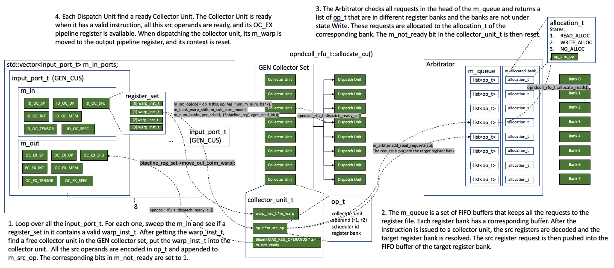

# Operand Collector (OC)



## Operand Collector Based Register File Unit

The SM core has a single Operand Collector Based Register File Unit modeled by class `opndcoll_rfu_t` as follows
```c++
// shader_core_ctx
opndcoll_rfu_t m_operand_collector;

// opndcoll_rdu_t: operand collector based register file unit
arbiter_t m_arbiter;
typedef std::map<unsigned, std::vector<collector_unit_t> cu_sets_t;
cu_sets_t m_cus;
std::vector<collector_unit_t *> m_cu;
std::vector<input_port_t> m_in_ports;
std::vector<dispatch_unit_t> m_dispatch_units;
```

The unit includes 
* Ports (`m_in_ports`): This contains the input pipeline register sets (ID_OC) and output register sets (OC_EX). The `warp_inst_t` in the ID_OC ports will be issued to a collector unit. Also, when the Collector Unit gets all the required source registers, it will be dispatched by a <mark>Dispatch Unit</mark> to the output pipeline register sets (OC_EX).
* Collector Units (`m_cu`): each collector unit can hold a single instruction at a time. It will send the request for source registers to the Arbitrator. Once all the source registers are ready, it can be dispatched by a <mark>Dispatch Unit</mark> to the output pipeline register sets (OC_EX).
* Arbitrator (`m_arbiter`): The Arbitrator takes the request for source operands from the <mark>Collector Units</mark> and put then in a request queue. The <mark>Arbitrator</mark> will issue the bank-conflict free request to the register file in each cycle. Notably, the <mark>Arbitrator</mark> is also used to handle the write back to the register file, and write back has higher priority than the read.
* Dispatch Unit (`m_dispatch_units`): Once a <mark>Collector Unit</mark> is ready, the <mark>Dispatch Unit</mark> will dispatch the `warp_inst_t` in the <mark>Collector Unit</mark> to the OC_EX register sets.

```c++
// shader_core_ctx::create_exec_pipeline()
m_operand_collector.init(m_config->gpgpu_num_reg_banks, this);

void opndcoll_rfu_t::init(unsigned num_banks, shader_core_ctx *shader) {
  m_shader = shader;
  m_arbiter.init(m_cu.size(), num_banks);
  // for( unsigned n=0; n<m_num_ports;n++ )
  //    m_dispatch_units[m_output[n]].init( m_num_collector_units[n] );
  m_num_banks = num_banks;
  m_bank_warp_shift = 0;
  m_warp_size = shader->get_config()->warp_size;
  m_bank_warp_shift = (unsigned)(int)(log(m_warp_size + 0.5) / log(2.0));
  assert((m_bank_warp_shift == 5) || (m_warp_size != 32));

  sub_core_model = shader->get_config()->sub_core_model;
  m_num_warp_sceds = shader->get_config()->gpgpu_num_sched_per_core;
  
  // For V100 GPU, it has 8 register banks and 4 schedulers
  if (sub_core_model)
    assert(num_banks % shader->get_config()->gpgpu_num_sched_per_core == 0);
  m_num_banks_per_sched =
      num_banks / shader->get_config()->gpgpu_num_sched_per_core;

  for (unsigned j = 0; j < m_cu.size(); j++) {
    m_cu[j]->init(j, num_banks, m_bank_warp_shift, shader->get_config(), this,
                  sub_core_model, m_num_banks_per_sched);
  }
  m_initialized = true;
}
```

In `QV100/gpgpusim.config`, we have
```c++
# disable specialized operand collectors and use generic operand collectors instead
-gpgpu_enable_specialized_operand_collector 0
-gpgpu_operand_collector_num_units_gen 8
-gpgpu_operand_collector_num_in_ports_gen 8
-gpgpu_operand_collector_num_out_ports_gen 8
```
So V100 has a single generic operand collector, which has 8 units, 8 input ports and 8 output ports.

## Ports
```c++
// shader_core_ctx::create_exec_pipeline()

// generic collector: the collector for all the purposes
m_operand_collector.add_cu_set(
      GEN_CUS, m_config->gpgpu_operand_collector_num_units_gen,
      m_config->gpgpu_operand_collector_num_out_ports_gen);

// gpgpu_operand_collector_num_in_ports_gen
for (unsigned i = 0; i < m_config->gpgpu_operand_collector_num_in_ports_gen; i++) {
  	// the ID_OC_SP/SFU/MEM are the input ports
    in_ports.push_back(&m_pipeline_reg[ID_OC_SP]);
    in_ports.push_back(&m_pipeline_reg[ID_OC_SFU]);
    in_ports.push_back(&m_pipeline_reg[ID_OC_MEM]);
  	// the OC_EX_SP/SFU/MEM are the output ports
    out_ports.push_back(&m_pipeline_reg[OC_EX_SP]);
    out_ports.push_back(&m_pipeline_reg[OC_EX_SFU]);
    out_ports.push_back(&m_pipeline_reg[OC_EX_MEM]);
  	// add tensor core
    if (m_config->gpgpu_tensor_core_avail) {
      in_ports.push_back(&m_pipeline_reg[ID_OC_TENSOR_CORE]);
      out_ports.push_back(&m_pipeline_reg[OC_EX_TENSOR_CORE]);
    }
  	// add DP units
    if (m_config->gpgpu_num_dp_units > 0) {
      in_ports.push_back(&m_pipeline_reg[ID_OC_DP]);
      out_ports.push_back(&m_pipeline_reg[OC_EX_DP]);
    }
  	// add INT units
    if (m_config->gpgpu_num_int_units > 0) {
      in_ports.push_back(&m_pipeline_reg[ID_OC_INT]);
      out_ports.push_back(&m_pipeline_reg[OC_EX_INT]);
    }
  	// add specialized units
    if (m_config->m_specialized_unit.size() > 0) {
      for (unsigned j = 0; j < m_config->m_specialized_unit.size(); ++j) {
        in_ports.push_back(
            &m_pipeline_reg[m_config->m_specialized_unit[j].ID_OC_SPEC_ID]);
        out_ports.push_back(
            &m_pipeline_reg[m_config->m_specialized_unit[j].OC_EX_SPEC_ID]);
      }
    }
  	// GEN_CUS is added to the cu_sets
    cu_sets.push_back((unsigned)GEN_CUS);
  	// add port ??
    m_operand_collector.add_port(in_ports, out_ports, cu_sets);
    in_ports.clear(), out_ports.clear(), cu_sets.clear();
  }
}