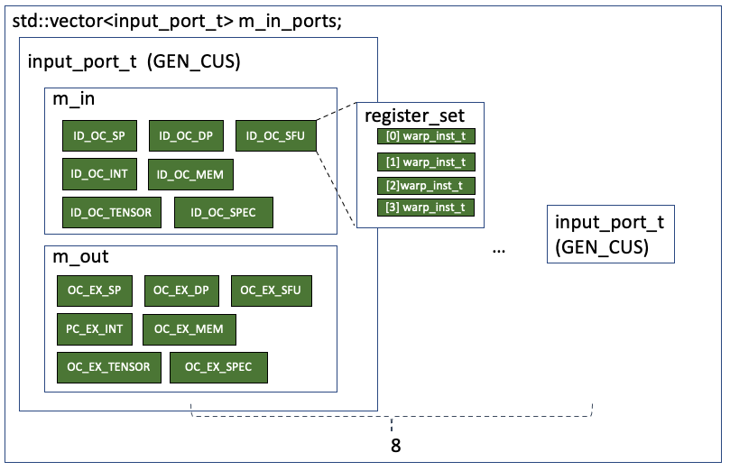
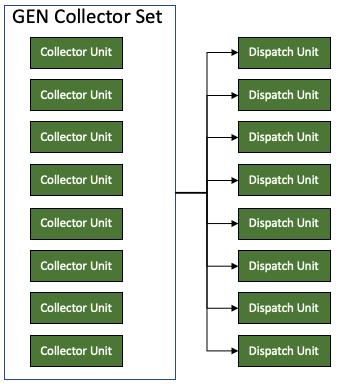

# Operand Collector (OC)


After issuing the instructions into the ID_OC pipeline register sets, the instruction has to collect all the source operands from the register file before issuing to the execution unit. To do this, the instruction is first fecthed by a collector unit. The unit sends operand request to the arbitrator, and the requests from different collectors are put into a FIFO queue based on the register bank of the operand. The arbitrator can resolve one request per register bank in each cycle. After the collector unit gets all the source operands, it can move the instruction to the OC_EX pipeline register set of the corresponding function unit.

## Operand Collector Based Register File Unit

### Definition

The SM core has a single Operand Collector Based Register File Unit modeled by class `opndcoll_rfu_t` as follows
```c++
// shader_core_ctx
opndcoll_rfu_t m_operand_collector;

// opndcoll_rdu_t: operand collector based register file unit
arbiter_t m_arbiter;
typedef std::map<unsigned, std::vector<collector_unit_t> cu_sets_t;
cu_sets_t m_cus;
std::vector<collector_unit_t *> m_cu;
std::vector<input_port_t> m_in_ports;
std::vector<dispatch_unit_t> m_dispatch_units;
```

The unit includes 
* Ports (`m_in_ports`): This contains the input pipeline register sets (ID_OC) and output register sets (OC_EX). The `warp_inst_t` in the ID_OC ports will be issued to a collector unit. Also, when the Collector Unit gets all the required source registers, it will be dispatched by a <mark>Dispatch Unit</mark> to the output pipeline register sets (OC_EX).
* Collector Units (`m_cu`): each collector unit can hold a single instruction at a time. It will send the request for source registers to the Arbitrator. Once all the source registers are ready, it can be dispatched by a <mark>Dispatch Unit</mark> to the output pipeline register sets (OC_EX).
* Arbitrator (`m_arbiter`): The Arbitrator takes the request for source operands from the <mark>Collector Units</mark> and put then in a request queue. The <mark>Arbitrator</mark> will issue the bank-conflict free request to the register file in each cycle. Notably, the <mark>Arbitrator</mark> is also used to handle the write back to the register file, and write back has higher priority than the read.
* Dispatch Unit (`m_dispatch_units`): Once a <mark>Collector Unit</mark> is ready, the <mark>Dispatch Unit</mark> will dispatch the `warp_inst_t` in the <mark>Collector Unit</mark> to the OC_EX register sets.

### Init()

```c++
// shader_core_ctx::create_exec_pipeline()
m_operand_collector.init(m_config->gpgpu_num_reg_banks, this);

void opndcoll_rfu_t::init(unsigned num_banks, shader_core_ctx *shader) {
  m_shader = shader;
  m_arbiter.init(m_cu.size(), num_banks);
  // for( unsigned n=0; n<m_num_ports;n++ )
  //    m_dispatch_units[m_output[n]].init( m_num_collector_units[n] );
  m_num_banks = num_banks;
  m_bank_warp_shift = 0;
  m_warp_size = shader->get_config()->warp_size;
  m_bank_warp_shift = (unsigned)(int)(log(m_warp_size + 0.5) / log(2.0));
  assert((m_bank_warp_shift == 5) || (m_warp_size != 32));

  sub_core_model = shader->get_config()->sub_core_model;
  m_num_warp_sceds = shader->get_config()->gpgpu_num_sched_per_core;
  
  // For V100 GPU, it has 8 register banks and 4 schedulers
  if (sub_core_model)
    assert(num_banks % shader->get_config()->gpgpu_num_sched_per_core == 0);
  m_num_banks_per_sched =
      num_banks / shader->get_config()->gpgpu_num_sched_per_core;

  for (unsigned j = 0; j < m_cu.size(); j++) {
    m_cu[j]->init(j, num_banks, m_bank_warp_shift, shader->get_config(), this,
                  sub_core_model, m_num_banks_per_sched);
  }
  m_initialized = true;
}
```

In `QV100/gpgpusim.config`, we have
```c++
# disable specialized operand collectors and use generic operand collectors instead
-gpgpu_enable_specialized_operand_collector 0
-gpgpu_operand_collector_num_units_gen 8
-gpgpu_operand_collector_num_in_ports_gen 8
-gpgpu_operand_collector_num_out_ports_gen 8
```
So V100 has a single generic operand collector, which has 8 units, 8 input ports and 8 output ports.

### Ports
V100 GPU has a generic collector unit set that can be used for all the function units. Notably, there is an option in the configruation file `m_config->enable_specialized_operand_collector`. If it is set, each function unit will have a specialized collector unit set. 

#### Definition
The port is defined as follows
```c++
// opndcoll_rfu_t::input_port_t
class input_port_t {
  public:
  input_port_t(port_vector_t &input, port_vector_t &output,
               uint_vector_t cu_sets)
    : m_in(input), m_out(output), m_cu_sets(cu_sets) {
      assert(input.size() == output.size());
      assert(not m_cu_sets.empty());
    }
  // private:
  port_vector_t m_in, m_out;
  uint_vector_t m_cu_sets;
};
```

#### Init()
The ports are added as follows
```c++
// shader_core_ctx::create_exec_pipeline()

// generic collector: the collector for all the purposes
m_operand_collector.add_cu_set(
      GEN_CUS, m_config->gpgpu_operand_collector_num_units_gen,
      m_config->gpgpu_operand_collector_num_out_ports_gen);

// gpgpu_operand_collector_num_in_ports_gen
for (unsigned i = 0; i < m_config->gpgpu_operand_collector_num_in_ports_gen; i++) {
  	// the ID_OC_SP/SFU/MEM are the input ports
    in_ports.push_back(&m_pipeline_reg[ID_OC_SP]);
    in_ports.push_back(&m_pipeline_reg[ID_OC_SFU]);
    in_ports.push_back(&m_pipeline_reg[ID_OC_MEM]);
  	// the OC_EX_SP/SFU/MEM are the output ports
    out_ports.push_back(&m_pipeline_reg[OC_EX_SP]);
    out_ports.push_back(&m_pipeline_reg[OC_EX_SFU]);
    out_ports.push_back(&m_pipeline_reg[OC_EX_MEM]);
  	// add tensor core
    if (m_config->gpgpu_tensor_core_avail) {
      in_ports.push_back(&m_pipeline_reg[ID_OC_TENSOR_CORE]);
      out_ports.push_back(&m_pipeline_reg[OC_EX_TENSOR_CORE]);
    }
  	// add DP units
    if (m_config->gpgpu_num_dp_units > 0) {
      in_ports.push_back(&m_pipeline_reg[ID_OC_DP]);
      out_ports.push_back(&m_pipeline_reg[OC_EX_DP]);
    }
  	// add INT units
    if (m_config->gpgpu_num_int_units > 0) {
      in_ports.push_back(&m_pipeline_reg[ID_OC_INT]);
      out_ports.push_back(&m_pipeline_reg[OC_EX_INT]);
    }
  	// add specialized units
    if (m_config->m_specialized_unit.size() > 0) {
      for (unsigned j = 0; j < m_config->m_specialized_unit.size(); ++j) {
        in_ports.push_back(
            &m_pipeline_reg[m_config->m_specialized_unit[j].ID_OC_SPEC_ID]);
        out_ports.push_back(
            &m_pipeline_reg[m_config->m_specialized_unit[j].OC_EX_SPEC_ID]);
      }
    }
  	// GEN_CUS is added to the cu_sets
    cu_sets.push_back((unsigned)GEN_CUS);
    m_operand_collector.add_port(in_ports, out_ports, cu_sets);
    in_ports.clear(), out_ports.clear(), cu_sets.clear();
  }
}

// opndcoll_rfu_t::add_port
void opndcoll_rfu_t::add_port(port_vector_t &input, port_vector_t &output,
                              uint_vector_t cu_sets) {
  m_in_ports.push_back(input_port_t(input, output, cu_sets));
}


```

At first, as it is a generic collector, the ID_OC pipeline register sets for all the function units are added to its `m_in` and the OC_EX are added to the `m_out`. There are 8 generic collector units in total. So the ports is illustrated as follows


### Collector Units

#### Definition
The collector units are modeled with class `collector_unit_t` as follows
```c++
class collector_unit_t {
   public:
    // constructors
    collector_unit_t() {
      m_free = true;
      m_warp = NULL;
      m_output_register = NULL;
      m_src_op = new op_t[MAX_REG_OPERANDS * 2];
      m_not_ready.reset();
      m_warp_id = -1;
      m_num_banks = 0;
      m_bank_warp_shift = 0;
    }
    // accessors
    // modifiers
    void init(unsigned n, unsigned num_banks, unsigned log2_warp_size,
              const core_config *config, opndcoll_rfu_t *rfu,
              bool m_sub_core_model, unsigned num_banks_per_sched);
    bool allocate(register_set *pipeline_reg, register_set *output_reg);

    void collect_operand(unsigned op) { m_not_ready.reset(op); }
    void dispatch();
    bool is_free() { return m_free; }

   private:
    bool m_free;
    unsigned m_cuid;  // collector unit hw id
    unsigned m_warp_id;
    warp_inst_t *m_warp;
    register_set
        *m_output_register;  // pipeline register to issue to when ready
    op_t *m_src_op;
    std::bitset<MAX_REG_OPERANDS * 2> m_not_ready;
    unsigned m_num_banks;
    unsigned m_bank_warp_shift;
    opndcoll_rfu_t *m_rfu;

    unsigned m_num_banks_per_sched;
    bool m_sub_core_model;
  };
```
It has some important members
* `warp_inst_t *m_warp;` This is used to hold the instruction collected from the ID_OC pipeline register.
* `op_t *m_src_op;` This is used to hold the source operands.
* `std::bitset<MAX_REG_OPERANDS * 2> m_not_ready;` This is used to track whether the source operand is returned by the Arbitrator

#### Init()

The Collector unit set is added as follows
```c++
// shader_core_ctx::create_exec_pipeline()

// generic collector: the collector for all the purposes
m_operand_collector.add_cu_set(
      GEN_CUS, m_config->gpgpu_operand_collector_num_units_gen,
      m_config->gpgpu_operand_collector_num_out_ports_gen);

// m_config->gpgpu_operand_collector_num_units_gen = 8
// m_config->gpgpu_operand_collector_num_out_ports_gen = 8

void opndcoll_rfu_t::add_cu_set(unsigned set_id, unsigned num_cu,
                                unsigned num_dispatch) {
  // Operand collector set GEN_CUS has a vector of collector_unit_t with 8 entries for V100
  m_cus[set_id].reserve(num_cu);

  for (unsigned i = 0; i < num_cu; i++) {
    m_cus[set_id].push_back(collector_unit_t()); // add a new collector_unit
    m_cu.push_back(&m_cus[set_id].back()); // put the same unit into the m_cu
  }
  // for now each collector set gets dedicated dispatch units.
  // Each output port gets a dispatch unit.
  // The dispatch unit can access all the collector units in the set
  for (unsigned i = 0; i < num_dispatch; i++) {
    m_dispatch_units.push_back(dispatch_unit_t(&m_cus[set_id]));
  }
}
```
The `collector_unit_t` objects are created and pushed to the `m_cus` and `m_cu` of the Operand Collector Based Register File Unit.

#### Allocate

The `allocate` function allocates and instruction from the ID_OC register set to the collector unit as follows
```c++
// void opndcoll_rfu_t::allocate_cu(unsigned port_num)
allocated = cu->allocate(inp.m_in[i], inp.m_out[i]);

bool opndcoll_rfu_t::collector_unit_t::allocate(register_set *pipeline_reg_set,
                                                register_set *output_reg_set) {
  assert(m_free);
  assert(m_not_ready.none());
  m_free = false;
  m_output_register = output_reg_set;
  warp_inst_t **pipeline_reg = pipeline_reg_set->get_ready();
  if ((pipeline_reg) and !((*pipeline_reg)->empty())) {
    m_warp_id = (*pipeline_reg)->warp_id();
    for (unsigned op = 0; op < MAX_REG_OPERANDS; op++) {
      int reg_num =
          (*pipeline_reg)
              ->arch_reg.src[op];  // this math needs to match that used in
                                   // function_info::ptx_decode_inst
      if (reg_num >= 0) {          // valid register
        m_src_op[op] = op_t(this, op, reg_num, m_num_banks, m_bank_warp_shift,
                            m_sub_core_model, m_num_banks_per_sched,
                            (*pipeline_reg)->get_schd_id());
        m_not_ready.set(op);
      } else
        m_src_op[op] = op_t();
    }
    // move_warp(m_warp,*pipeline_reg);
    // The line 
    pipeline_reg_set->move_out_to(m_warp);
    return true;
  }
  return false;
}
```
It does several things
* set the output OC_EX register set
* get the `warp_inst_t` object from the ID_OC register set
* get all the source operands and put them into the `m_src_op`
* set the bits in `m_not_ready`, which indicates that the operands are not ready

#### ready()
This function returns whether the collector unit is ready for dispatch
```c++
// opndcoll_rfu_t::collector_unit_t
bool opndcoll_rfu_t::collector_unit_t::ready() const {
  // (!m_free) the collector unit is not free
  // m_not_ready.none(): Returns whether none of the bits is set
  // (*m_output_register).has_free() the output register OC_EX is free
  return (!m_free) && m_not_ready.none() && (*m_output_register).has_free();
}
```
The unit is ready if 
* The collector is occupied by an instruction
* All the source operands are ready
* Its output port (OC_EX registers) is free

#### dispatch()
The `dispatch()` function moves the `warp_inst_t` to the OC_EX register and reset the collector.
```c++
void opndcoll_rfu_t::collector_unit_t::dispatch() {
  assert(m_not_ready.none());
  // move_warp(*m_output_register,m_warp);
  // put the m_warp into the OC_EX pipeline register
  m_output_register->move_in(m_warp);
  // free the collector unit
  m_free = true;
  // reset all the members
  m_output_register = NULL;
  for (unsigned i = 0; i < MAX_REG_OPERANDS * 2; i++) m_src_op[i].reset();
}
```


### Arbitrator

#### Definition
The Arbitrator is modeled by the class `arbiter_t` as follows
```c++
class arbiter_t {
   public:
    // constructors
    arbiter_t() {
      m_queue = NULL;
      m_allocated_bank = NULL;
      m_allocator_rr_head = NULL;
      _inmatch = NULL;
      _outmatch = NULL;
      _request = NULL;
      m_last_cu = 0;
    }
    void init(unsigned num_cu, unsigned num_banks);

    // accessors

    // modifiers
    std::list<op_t> allocate_reads();

    void add_read_requests(collector_unit_t *cu);
    void allocate_bank_for_write(unsigned bank, const op_t &op);
    void allocate_for_read(unsigned bank, const op_t &op);

   private:

    allocation_t *m_allocated_bank;  // bank # -> register that wins
    std::list<op_t> *m_queue;

    unsigned *
        m_allocator_rr_head;  // cu # -> next bank to check for request (rr-arb)
    unsigned m_last_cu;       // first cu to check while arb-ing banks (rr)

    int *_inmatch;
    int *_outmatch;
    int **_request;
  };
```

The `m_allocated_bank` is a set of state machines that track the state of each register bank. It has states like `READ_ALLOC`, `WRITE_ALLOC`, and `NO_ALLOC`. 
The `m_queue` is a FIFO queue that buffers all the read requests to a register bank. Basically, the number of entries in `m_allocated_bank` and `m_queue` equals to the number of register banks in the SM core (8 for V100).

#### Init()
It just sets all the members in the class.
```c++
void init(unsigned num_cu, unsigned num_banks) {
    assert(num_cu > 0);
    assert(num_banks > 0);
    m_num_collectors = num_cu;
    m_num_banks = num_banks;
    _inmatch = new int[m_num_banks];
    _outmatch = new int[m_num_collectors];
    _request = new int *[m_num_banks];
    for (unsigned i = 0; i < m_num_banks; i++)
    _request[i] = new int[m_num_collectors];
    m_queue = new std::list<op_t>[num_banks];
    m_allocated_bank = new allocation_t[num_banks];
    m_allocator_rr_head = new unsigned[num_cu];
    for (unsigned n = 0; n < num_cu; n++)
    m_allocator_rr_head[n] = n % num_banks;
    reset_alloction();
}
```

#### add_read_requests()
This function gets all the source operands from the collector unit, and put them into the `m_queue[bank]` queue.
```c++
void add_read_requests(collector_unit_t *cu) {
  // const op_t *get_operands() const { return m_src_op; }
  const op_t *src = cu->get_operands();
  for (unsigned i = 0; i < MAX_REG_OPERANDS * 2; i++) {
    const op_t &op = src[i];
    if (op.valid()) {
      unsigned bank = op.get_bank();
      m_queue[bank].push_back(op);  // put the register to the bank
    }
  }
}
```

#### allocate_bank_for_write()
Just set the state machine and put the op to the `m_allocated_bank`. This will be used for write back.

```c++
void allocate_bank_for_write(unsigned bank, const op_t &op) {
    assert(bank < m_num_banks);
    m_allocated_bank[bank].alloc_write(op);
}

// opndcoll_rfu_t::allocation_t
void alloc_write(const op_t &op) {
    assert(is_free());
    m_allocation = WRITE_ALLOC;
    m_op = op;
}
```

### Dispatch Unit

#### Definition

The dispatch unit is modeled with class `dispatch_unit_t`. 
```c++
class dispatch_unit_t {
  public:
  dispatch_unit_t(std::vector<collector_unit_t> *cus) {
    m_last_cu = 0;
    // link the collector set
    m_collector_units = cus;
    m_num_collectors = (*cus).size();
    m_next_cu = 0;
  }
	
  // seems return a collector
  collector_unit_t *find_ready() {
    for (unsigned n = 0; n < m_num_collectors; n++) {
      unsigned c = (m_last_cu + n + 1) % m_num_collectors;
      if ((*m_collector_units)[c].ready()) {
        m_last_cu = c;
        return &((*m_collector_units)[c]);
      }
    }
    return NULL;
  }

  private:
  unsigned m_num_collectors;
  std::vector<collector_unit_t> *m_collector_units;
  unsigned m_last_cu;  // dispatch ready cu's rr
  unsigned m_next_cu;  // for initialization
};
```
According to `std::vector<collector_unit_t> *m_collector_units`, each dispatch unit can access all the collector units. 

#### init()

The dispatch units are added here
```c++
// shader_core_ctx::create_exec_pipeline()
m_operand_collector.add_cu_set(
      GEN_CUS, m_config->gpgpu_operand_collector_num_units_gen,
      m_config->gpgpu_operand_collector_num_out_ports_gen);

// m_config->gpgpu_operand_collector_num_units_gen = 8
// m_config->gpgpu_operand_collector_num_out_ports_gen = 8

void opndcoll_rfu_t::add_cu_set(unsigned set_id, unsigned num_cu,
                                unsigned num_dispatch) {
  // Operand collector set GEN_CUS has a vector of collector_unit_t with 8 entries for V100
  m_cus[set_id].reserve(num_cu);

  for (unsigned i = 0; i < num_cu; i++) {
    m_cus[set_id].push_back(collector_unit_t()); // add a new collector_unit
    m_cu.push_back(&m_cus[set_id].back()); // put the same unit into the m_cu
  }
  // for now each collector set gets dedicated dispatch units.
  // Each output port gets a dispatch unit.
  // The dispatch unit can access all the collector units in the set
  for (unsigned i = 0; i < num_dispatch; i++) {
    m_dispatch_units.push_back(dispatch_unit_t(&m_cus[set_id]));
  }
}
```
After adding the collector units, the dispatch units are also added. Each collector unit set has its own set of dispatch units. And each dispatch units can access all the collector units in the current set.



#### find_ready()
```c++
collector_unit_t *find_ready() {
    for (unsigned n = 0; n < m_num_collectors; n++) {
      unsigned c = (m_last_cu + n + 1) % m_num_collectors;
      if ((*m_collector_units)[c].ready()) {
        m_last_cu = c;
        return &((*m_collector_units)[c]);
      }
    }
    return NULL;
  }
```
This simply find a ready collector unit in the collector unit set.

### step()
The `opndcoll_rfu_t::step()` is called in each cycle. It is defined as follows
```c++
void step() {
    dispatch_ready_cu();
    allocate_reads();
    for (unsigned p = 0; p < m_in_ports.size(); p++) allocate_cu(p);
    process_banks();
  }
```

#### process_banks()
This just reset all the bank's state machine to `NO_ALLOC`.
```c++
void process_banks() { m_arbiter.reset_alloction(); }

void reset_alloction() {
    for (unsigned b = 0; b < m_num_banks; b++) m_allocated_bank[b].reset();
}

void reset() { m_allocation = NO_ALLOC; }
```

#### allocate_cu()
The `opndcoll_rfu_t::allocate_cu` allocates the instructions from ID_OC pipeline registers to the collector units.

```c++
// opndcoll_rfu_t::step()
// the m_in_port.size() here seems to be 8 for QV100
for (unsigned p = 0; p < m_in_ports.size(); p++) allocate_cu(p);

void opndcoll_rfu_t::allocate_cu(unsigned port_num) {
  // get the input port
  input_port_t &inp = m_in_ports[port_num];
  // traverse all the input ports [ID_OC_SP, ID_OC_DP, ...]
  for (unsigned i = 0; i < inp.m_in.size(); i++) {
    // if the port is ready
    if ((*inp.m_in[i]).has_ready()) {
      // find a free cu
      // traverse the collector unit sets (there is only one)
      for (unsigned j = 0; j < inp.m_cu_sets.size(); j++) {
        // get the set
        std::vector<collector_unit_t> &cu_set = m_cus[inp.m_cu_sets[j]];
        bool allocated = false;
        // traverse the collector units in the set (should be 8 for QV100)
        for (unsigned k = 0; k < cu_set.size(); k++) {
          // find a free one
          if (cu_set[k].is_free()) {
            collector_unit_t *cu = &cu_set[k];
            allocated = cu->allocate(inp.m_in[i], inp.m_out[i]);
            // request is allocated to the arbiter
            m_arbiter.add_read_requests(cu);
            break;
          }
        }
        if (allocated) break;  // cu has been allocated, no need to search more.
      }
      break;  // can only service a single input, if it failed it will fail for
              // others.
    }
  }
}
```
Basically, each input port is traversed to find a ready instruction. Then, all the collector units are traversed to fild a free unit. The instruction is allocated (` allocated = cu->allocate(inp.m_in[i], inp.m_out[i]);`) and the source operand requests are sent to the arbitrator `m_arbiter.add_read_requests(cu);`.

#### allocate_reads()

In this function, the arbitrator checks the request and returns a list of op_t that are in different register banks and the banks are not under state Write.

Notably, the authors annoted that

> a list of registers that (a) are in different register banks, (b) do not go to the same operand collector

However, it seems that argument (b) is not true, unless the comment here is removed
```c++
if ((output < _outputs) && (_inmatch[input] == -1) &&
          //( _outmatch[output] == -1 ) &&   //allow OC to read multiple reg
          (_request[input][output])) {
```

```c++
void opndcoll_rfu_t::allocate_reads() {
  // process read requests that do not have conflicts
  std::list<op_t> allocated = m_arbiter.allocate_reads();
  // to be continue
}

// opndcoll_rfu_t::arbiter_t
int *_inmatch;
int *_outmatch;
int **_request;

std::list<opndcoll_rfu_t::op_t> opndcoll_rfu_t::arbiter_t::allocate_reads() {
  // create a list of results
  std::list<op_t> result;  
  
  // a list of registers that (a) are in different register banks,
  // (b) do not go to the same operand collector (Not True!!!)
	
  
  // input the the register bank
  // output is the collector units
  int input;
  int output;
  int _inputs = m_num_banks;  // 8 banks
  int _outputs = m_num_collectors;  // 8 collectors
  int _square = (_inputs > _outputs) ? _inputs : _outputs;
  int _pri = (int)m_last_cu;

  // Clear matching: set all the entries to -1
  for (int i = 0; i < _inputs; ++i) _inmatch[i] = -1;
  for (int j = 0; j < _outputs; ++j) _outmatch[j] = -1;
	
  // traverse all the bank request buffers and collectors
  for (unsigned i = 0; i < m_num_banks; i++) {
    // set the request to bank request buffer [i] to zero.
    for (unsigned j = 0; j < m_num_collectors; j++) {
      _request[i][j] = 0;
    }
    // if the bank request buffer is not empty
    if (!m_queue[i].empty()) {
      const op_t &op = m_queue[i].front();
      int oc_id = op.get_oc_id(); // get Collector Unit id
      _request[i][oc_id] = 1; // bank request [collector unit] set to 1
    }
    if (m_allocated_bank[i].is_write()) {
      _inmatch[i] = 0;  // write gets priority. The input bank assigned to write
    }
  }

  ///// wavefront allocator from booksim... --->
	
  // loop through all the collector units
  for (int p = 0; p < _square; ++p) {
    output = (_pri + p) % _outputs;

    // Step through the current diagonal
    for (input = 0; input < _inputs; ++input) {
      // the register bank is empty, there is a request from collector [output] to the register bank
      if ((output < _outputs) && (_inmatch[input] == -1) &&
          //( _outmatch[output] == -1 ) &&   //allow OC to read multiple reg
          (_request[input][output])) {
        // Grant!
        _inmatch[input] = output; // register bank link to collector unit
        _outmatch[output] = input;  // collector unit link to bank
      }
			// check next collector
      output = (output + 1) % _outputs;
    }
  }

  // Round-robin the priority diagonal
  _pri = (_pri + 1) % _outputs;

  /// <--- end code from booksim

  m_last_cu = _pri;
  for (unsigned i = 0; i < m_num_banks; i++) {
    if (_inmatch[i] != -1) {
      if (!m_allocated_bank[i].is_write()) {
        unsigned bank = (unsigned)i;
        op_t &op = m_queue[bank].front();
        result.push_back(op);
        m_queue[bank].pop_front();
      }
    }
  }

  return result;
}
```