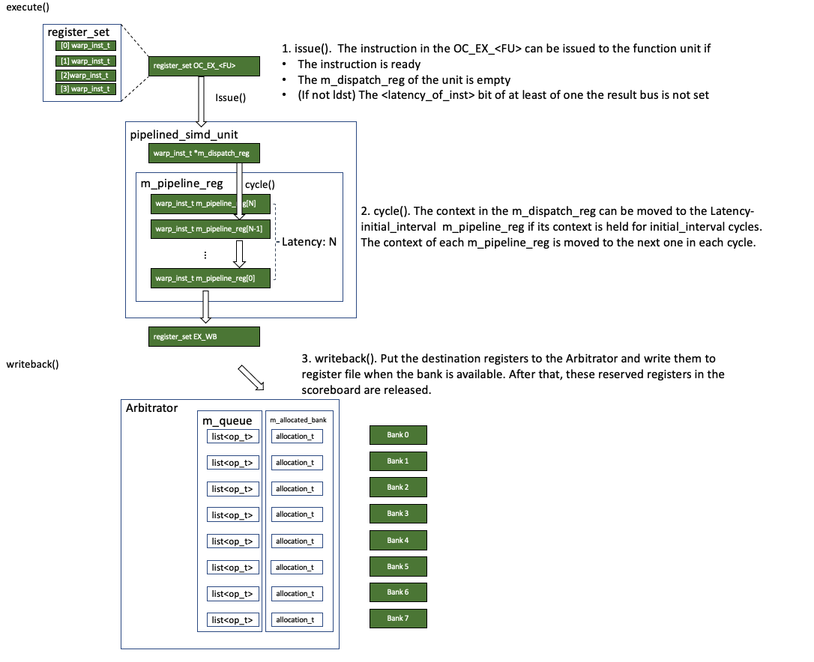

# Writeback (WB)


This note covers the `writeback()` stage of the SM core's pipeline.
```c++
// shader_core_ctx::cycle()
writeback();
```
The context in the EX_WB pipeline register set is written back to the register file by the Arbitrator. 

## shader_core_ctx::writeback()
The `writeback()` for the SM core is defined as follows
```c++
void shader_core_ctx::writeback() {
  unsigned max_committed_thread_instructions =
      m_config->warp_size *
      (m_config->pipe_widths[EX_WB]);  // from the functional units
	
  // Find a ready EX_WB pipeline register
  warp_inst_t **preg = m_pipeline_reg[EX_WB].get_ready();
  warp_inst_t *pipe_reg = (preg == NULL) ? NULL : *preg;
  while (preg and !pipe_reg->empty()) {
    /*
     * Right now, the writeback stage drains all waiting instructions
     * assuming there are enough ports in the register file or the
     * conflicts are resolved at issue.
     */
    /*
     * The operand collector writeback can generally generate a stall
     * However, here, the pipelines should be un-stallable. This is
     * guaranteed because this is the first time the writeback function
     * is called after the operand collector's step function, which
     * resets the allocations. There is one case which could result in
     * the writeback function returning false (stall), which is when
     * an instruction tries to modify two registers (GPR and predicate)
     * To handle this case, we ignore the return value (thus allowing
     * no stalling).
     */

    m_operand_collector.writeback(*pipe_reg);
    unsigned warp_id = pipe_reg->warp_id();
    // release the register from the scoreboard
    m_scoreboard->releaseRegisters(pipe_reg);
    m_warp[warp_id]->dec_inst_in_pipeline();
    warp_inst_complete(*pipe_reg);
    m_gpu->gpu_sim_insn_last_update_sid = m_sid;
    m_gpu->gpu_sim_insn_last_update = m_gpu->gpu_sim_cycle;
    m_last_inst_gpu_sim_cycle = m_gpu->gpu_sim_cycle;
    m_last_inst_gpu_tot_sim_cycle = m_gpu->gpu_tot_sim_cycle;
    pipe_reg->clear();
    // continue
    preg = m_pipeline_reg[EX_WB].get_ready();
    pipe_reg = (preg == NULL) ? NULL : *preg;
    // there could be multiple pipe_reg? Anyway
  }
}
```
At first, a ready slot in the EX_WB register set is identified and loaded to `preg`. If it is valid, the `m_operand_collector.writeback` is called. Then, the destination register is released from he scoreboard and the slot in EX_WB register set is cleared. It continues until all the ready instructions in the EX_WB register set are written back.

## opndcoll_rfu_t::writeback()

Let's take a closer look at the `m_operand_collector.writeback` defined as follows
```c++
bool opndcoll_rfu_t::writeback(warp_inst_t &inst) {
  assert(!inst.empty());
  // get destination registers
  std::list<unsigned> regs = m_shader->get_regs_written(inst);
  for (unsigned op = 0; op < MAX_REG_OPERANDS; op++) {
    int reg_num = inst.arch_reg.dst[op];  // this math needs to match that used
                                          // in function_info::ptx_decode_inst
    if (reg_num >= 0) {                   // valid register
      // compute bank
      unsigned bank = register_bank(reg_num, inst.warp_id(), m_num_banks,
                                    m_bank_warp_shift, sub_core_model,
                                    m_num_banks_per_sched, inst.get_schd_id());
      // if the bank is idle
      if (m_arbiter.bank_idle(bank)) {
        // allocate the write
        m_arbiter.allocate_bank_for_write(
            bank,
            op_t(&inst, reg_num, m_num_banks, m_bank_warp_shift, sub_core_model,
                 m_num_banks_per_sched, inst.get_schd_id()));
        inst.arch_reg.dst[op] = -1;
      } else {
        return false;
      }
    }
  }

  // some statistics
  return true;
}
```
At first, it collects all the destination registers in the list `regs`. Then, it traverses all the entries in this list. For each register, the bank id is computed (`unsigned bank`). The Arbitrator checks whether the bank is available. If it is, the destination register is allocated to the Arbitrator. Otherwise, return false.
