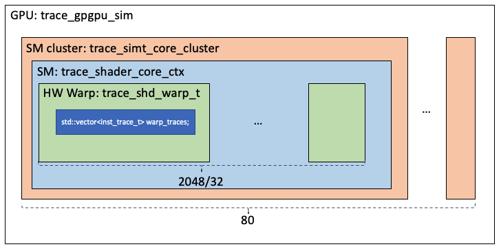

Zhaodong Chen

This note aims to put together major components from the simulator and help understanding the entire simulation process from the source code level. We will focus on the trace-driven simulation.
***

# Load Trace to GPU

## Input Files

The trace-driven simulation takes two input files: `kernel-x.traceg` and `kernelslist.g`. An example of `kernelslist.g` is as follows

```
MemcpyHtoD,0x00007efe7b500000,2052
MemcpyHtoD,0x00007efe7b500a00,262144
MemcpyHtoD,0x00007efe7b540a00,524288
MemcpyHtoD,0x00007efe7b600000,262144
MemcpyHtoD,0x00007efe7b5c0a00,2048
kernel-1.traceg
```

It includes two types of commands: `MemcpyHtoD` and `kernel launch`. The `MemcpyHtoD` is simply defined with a string. The `kernel launch` leads the parser to the `kernel-x.traceg` file. Notably, the `MemcpyHtoD` should match the memory address used in the kernel's trace.

Then, let's see an example of `kernel-x.traceg` file
```shell
# Basic information of the kernel
-kernel name = KERNEL_NAME
-kernel id = 1
-grid dim = (512,8,1)
-block dim = (32,1,1)
-shmem = 0
-nregs = 48
-binary version = 70  # Used to select the opcode map. E.g. 70 for VOLTA
-cuda stream id = 0
-shmem base_addr = 0x00007efeb0000000
-local mem base_addr = 0x00007efeb2000000
-nvbit version = 1.5
-accelsim tracer version = 3

#traces format = PC mask dest_num [reg_dests] opcode src_num [reg_srcs] mem_width [adrrescompress?] [mem_addresses]


#BEGIN_TB

thread block = 0,0,0

warp = 0
insts = 1212
0000 ffffffff 1 R1 IMAD.MOV.U32 2 R255 R255 0 
0010 00000000 0 SHFL.IDX 4 R255 R255 R255 R255 0 
.....
1020 ffffffff 1 R24 LDG.E.128.CONSTANT.SYS 1 R44 16 2 0x7efe7b60c300 16 16 16 2000 16 16 16 976 16 16 16 2000 16 16 16 6096 16 16 16 4048 16 16 16 3024 16 16 16 976 16 16 16 
.....

warp = 1
inst = ...
....

#END_TB

#BEGIN_TB
...
#END_TB

..
```

First, the basic information of the kernel is provided. Then, the traces for each thread block is marked with key words `#BEGIN_TB` and `#END_TB`. Each thread block has several warps, the begining of each warp is marked with `warp = warp_id` followed by the total number of traces of the warp (e.g. `insts = 1212`).

The format of the trace is as follows
```
PC mask dest_num [reg_dests] opcode src_num [reg_srcs] mem_width [adrrescompress?] [mem_addresses]
```
## Process the Trace Files
In the main function, the trace files are processed as follows
```c++
// Step 1: create the trace_parser
trace_parser tracer(tconfig.get_traces_filename());

// Step 2: get all the MemcpyHtoD and kernels (commands)
std::vector<trace_command> commandlist = tracer.parse_commandlist_file();

// Loop: travers all the commands
for command in commandlist{
    if command is MemcpyHtoD{
        // Do something
    }
    if command is Launch Kernel{
        // get kernel info
        trace_kernel_info_t kernel_info = create_kernel_info(...);
        // Load the kernel_info into the simulator
        m_gpgpu_sim->launch(kernel_info);
        while (m_gpgpu_sim->active()){
            m_gpgpu_sim->cycle()
        }
    }
}    
```

## Class: trace_kernel_info

The `(trace_)kernel_info` is an important interface between the trace files and the performance simulator. In particular, it provides a function that load the trace of a thread block into a vector of vector of `inst_trace_t`:
```c++
class trace_kernel_info_t : public kernel_info_t {
public:
  bool get_next_threadblock_traces(
      std::vector<std::vector<inst_trace_t> *> threadblock_traces);
private:
  // Some other functions and basic-information members
};
```
Most of the members in this class are just providing some functionality and basic informations of a kernel. The most important function is `get_next_threadblock_traces`. It takes a vector of vector as input
```c++
// Input: vector of vector of inst_trace_t
std::vector<std::vector<inst_trace_t> *> threadblock_traces;
```

It is a vector of vector because each thread block has several warps, and each warp has several instructions. So the first level is the index to the warp, and the second level is the index to individual instructions. 

The whole container is cleared at the begining with
```c++
for (unsigned i = 0; i < threadblock_traces.size(); ++i) {
    threadblock_traces[i]->clear();
}
```
Then, the slots are filled with
```c++
threadblock_traces[warp_id]->at(inst_count).parse_from_string(line, trace_version);
```
In which the vector of the target warp is located (`warp_id`), then the slot for the instruction is found (`inst_count`). The slot is filled with the trace by calling the function `inst_trace_t::parse_from_string()`, which gets the following informations from the trace string and encodes it into an instance of class `inst_trace_t`.
```c++
struct inst_trace_t {
  inst_trace_t();
  inst_trace_t(const inst_trace_t &b);
	
  // Basic informations
  unsigned m_pc;  // pc of the instruction
  unsigned mask;  // active mask
  unsigned reg_dsts_num;  // number of destinition register
  unsigned reg_dest[MAX_DST];  // an array of destinition register
  std::string opcode;  // Opcode string
  unsigned reg_srcs_num;  // number of src registers
  unsigned reg_src[MAX_SRC];  // an array of source register
  inst_memadd_info_t *memadd_info;  // memory info
	
  // Other helper functions
  bool parse_from_string(std::string trace, unsigned tracer_version);

  bool check_opcode_contain(const std::vector<std::string> &opcode,
                            std::string param) const;

  unsigned
  get_datawidth_from_opcode(const std::vector<std::string> &opcode) const;

  std::vector<std::string> get_opcode_tokens() const;

  ~inst_trace_t();
};
```
# Architecture Hierarchy


The GPU is modeled as follows. The class `trace_simt_core_cluster` models the whole GPU. Its member, `trace_gpgpu_sim->m_cluster`, is a vector of `trace_simt_core_cluster` objects. Each object models an SM cluster. In each cluster, there is memeber, `trace_simt_core_cluster->m_core`, that models the SM cores in this cluster. Each SM core is modeled with an object of `trace_shader_core_ctx`. Within the SM core, there is a set of hardware warps, `trace_shader_core_ctx->m_warp`, modeled by class `trace_shd_warp_t`. The number of hardware warps in each SM equals to the maximum number of threads (2048 for V100) divided by the warp size 32.

# Issue a Thread Block
When a thread block is issued, all its traces are loaded into the hardware warps of the target SM core. Issuing a thread block takes a hierarchical call as follows:

*  `gpgpu_sim::cycle()`
    * `gpgpu_sim::issue_block2core()`
        * `simt_core_cluster::issue_block2core()`
            * `shader_core_ctx::issue_block2core()`
                * `trace_shader_core_ctx::init_warps()`
                    * `trace_shader_core_ctx::init_traces()`
                        * `trace_kernel_info_t::get_next_threadblock_traces()`

## gpgpu_sim::cycle()
In each simulation cycle, the `gpgpu_sim::cycle()` is called. This function takes no arguments.
```c++
// main()
if (m_gpgpu_sim->active()) {
  m_gpgpu_sim->cycle();
  sim_cycles = true;
  m_gpgpu_sim->deadlock_check();
} 
```

## gpgpu_sim::issue_block2core()
In the `gpgpu_sim::cycle()`, besides calling `cycle()` function of other units like the cores, it also call the function `gpgpu_sim::issue_block2core()`, which also takes no argument.
```c++
// gpgpu_sim::cycle()
issue_block2core();
```
In `gpgpu_sim::issue_block2core()`, we have
```c++
void gpgpu_sim::issue_block2core() {
  unsigned last_issued = m_last_cluster_issue;
  for (unsigned i = 0; i < m_shader_config->n_simt_clusters; i++) {
    // starting from the previous issued SM cluster, call issue_block2core one by one
    unsigned idx = (i + last_issued + 1) % m_shader_config->n_simt_clusters;
    // Multiple CTAs (thread blocks) can be issued in each step. 
    // The function simt_core_cluster::issue_block2core() returns the number of CTAs issued
    unsigned num = m_cluster[idx]->issue_block2core();
    if (num) {
      m_last_cluster_issue = idx;
      // increment the launched CTAs
      m_total_cta_launched += num;
    }
  }
}
```
Basically, all the SM clusters are traversed. The traversal starts from the last issued cluster. For each cluster, `issue_block2core` is called, which returns the number of blocks issued by this cluster. This is incremented to the member `gpgpu_sim::m_total_cta_launched`.

## simt_core_cluster::issue_block2core()

In `simt_core_cluster::issue_block2core()`, we have
```c++
unsigned simt_core_cluster::issue_block2core() {
  // a counter initialized to 0
  unsigned num_blocks_issued = 0;
  // Traverse all the SMs in this SM cluster
  for (unsigned i = 0; i < m_config->n_simt_cores_per_cluster; i++) {
    // Also start from the m_cta_issue_next_core
    unsigned core =
        (i + m_cta_issue_next_core + 1) % m_config->n_simt_cores_per_cluster;
		
    // Fetch the kernel
    kernel_info_t *kernel;
    // Something about kernel selection
    
    // If there are remaining CTAs in the kernel and the core can issue a block
    if (m_gpu->kernel_more_cta_left(kernel) && m_core[core]->can_issue_1block(*kernel)) {
      // issue the block
      m_core[core]->issue_block2core(*kernel);
      // issue one CTA (block) to a core at each cycle
      num_blocks_issued++;
      // last issued core is the current core
      m_cta_issue_next_core = core;
      break;
    }
  }
  return num_blocks_issued;
}
```
Each SM cluster sweeps all its SMs. If there are unissued blocks of the kernel and the SM can issue 1 block, a block is issued to the core. Let's take a step aside and see how each SM determines whether it can issue more blocks
```c++
bool shader_core_ctx::can_issue_1block(kernel_info_t &kernel) {
  // Something about concurrent kernels on one SM
  return (get_n_active_cta() < m_config->max_cta(kernel));
}
```
This is quite simple. As the config knows the resources (reg, shared memory) occupied by the kernel, it can compute the maximum number of CTAs supported by each SM. So simply check whether the number of active CTAs is smaller than the upper bound.

## shader_core_ctx::issue_block2core()

In `shader_core_ctx::issue_block2core()`, we only want to issue 1 CTA if it is possible. We have
```c++
void shader_core_ctx::issue_block2core(kernel_info_t &kernel) {

  // find a free CTA context
  // init it with the max value
  unsigned free_cta_hw_id = (unsigned)-1;

  // get the maximum number of CTAs supported by the SM
  unsigned max_cta_per_core;
  max_cta_per_core = kernel_max_cta_per_shader;
  
  // Find an empty slot
  for (unsigned i = 0; i < max_cta_per_core; i++) {
    if (m_cta_status[i] == 0) {
      free_cta_hw_id = i;
      break;
    }
  }
  assert(free_cta_hw_id != (unsigned)-1); // the free_cta_hw_id should be updated

  // determine hardware threads and warps that will be used for this CTA
  // Get the thread block size. 
  int cta_size = kernel.threads_per_cta();
  
  int padded_cta_size = cta_size;
  // Something about padding the size when it is not multiple of warp size
  

  // compute the target warp id. There are 2048/32 hardware warps. 

  unsigned int start_thread, end_thread;
  
  start_thread = free_cta_hw_id * padded_cta_size;
    end_thread = start_thread + cta_size;

  // reset the microarchitecture state of the selected hardware thread and warp
  // contexts
  reinit(start_thread, end_thread, false);

  // Something about Functional simulation

  // initialize the SIMT stacks and fetch hardware
  init_warps(free_cta_hw_id, start_thread, end_thread, ctaid, cta_size, kernel);
  m_n_active_cta++;
}
```
It first computes start and end threads occupied by the CTA. Then it calls the `trace_shader_core_ctx::init_warps`

## trace_shader_core_ctx::init_warps()

In `trace_shader_core_ctx::init_warps`, we have
```c++
void trace_shader_core_ctx::init_warps(unsigned cta_id, unsigned start_thread,
                                       unsigned end_thread, unsigned ctaid,
                                       int cta_size, kernel_info_t &kernel) {
  // call base class
  shader_core_ctx::init_warps(cta_id, start_thread, end_thread, ctaid, cta_size,
                              kernel);

  // then init traces
  unsigned start_warp = start_thread / m_config->warp_size;
  unsigned end_warp = end_thread / m_config->warp_size +
                      ((end_thread % m_config->warp_size) ? 1 : 0);

  init_traces(start_warp, end_warp, kernel);
}
```
It compute the start warp and end hardware warp of the CTA, and call the `trace_shader_core_ctx::init_traces()`

## trace_shader_core_ctx::init_traces()
```c++
void trace_shader_core_ctx::init_traces(unsigned start_warp, unsigned end_warp,
                                        kernel_info_t &kernel) {
	
  // create the vector of vector of instructions
  // currently, it is empty. Its entries will be the warp_traces member in each trace_shf_warp_t
  // They will be added to the list in the following loop
  std::vector<std::vector<inst_trace_t> *> threadblock_traces;
  
  // this locates the warps used for this kernel (I guess)
  for (unsigned i = start_warp; i < end_warp; ++i) {
    // simple reinterpretation
    trace_shd_warp_t *m_trace_warp = static_cast<trace_shd_warp_t *>(m_warp[i]);
    // clear the warp
    m_trace_warp->clear();
    // the threadblock_traces is composed of the warp_traces member in each trace_shf_warp_t
    threadblock_traces.push_back(&(m_trace_warp->warp_traces));
  }
  // cast input kernel into into trace_kernel_info_t
  trace_kernel_info_t &trace_kernel =
      static_cast<trace_kernel_info_t &>(kernel);
  // fill the threadblock_traces with the with the traces from file
  trace_kernel.get_next_threadblock_traces(threadblock_traces);
  // Something else
}
```
The `trace_shd_warp_t`s are the hardware warps. They have a vector `trace_shd_warp_t::warp_trace`  to store the traces of the warp.
## get_next_threadblock_traces()
```c++
bool trace_kernel_info_t::get_next_threadblock_traces(
   std::vector<std::vector<inst_trace_t> *> threadblock_traces) {
  
  // threadblock_traces is a vector of vector of inst_trace_t
  // the vector of vector is reset to empty containers
  for (unsigned i = 0; i < threadblock_traces.size(); ++i) {
    threadblock_traces[i]->clear();
  }
	
  // The parser is called to get the next_threadblock_trace
  bool success = m_parser->get_next_threadblock_traces(
      threadblock_traces, m_kernel_trace_info->trace_verion);

  return success;
} 

bool trace_parser::get_next_threadblock_traces(
    std::vector<std::vector<inst_trace_t> *> threadblock_traces,
    unsigned trace_version) {
  
  // Simularly, the container is cleared at the begining
  for (unsigned i = 0; i < threadblock_traces.size(); ++i) {
    threadblock_traces[i]->clear();
  }

  unsigned block_id_x = 0, block_id_y = 0, block_id_z = 0;
  // A flag the indicates the screening reaches a threadblock
  bool start_of_tb_stream_found = false;

  unsigned warp_id = 0;
  unsigned insts_num = 0;
  unsigned inst_count = 0;  // counter for the instructions.
	
  // Actually, the file is not closed
  // So I guess it will continue after the loop breaks and accessed again
  while (!ifs.eof()) {
    std::string line;
    std::stringstream ss;
    std::string string1, string2;

    getline(ifs, line);
		// Skip the empty line
    if (line.length() == 0) {
      continue;
    } else {
      ss.str(line);
      ss >> string1 >> string2;
      if (string1 == "#BEGIN_TB") {
        if (!start_of_tb_stream_found) {
          start_of_tb_stream_found = true;  // the flag is set to True
        } else
          assert(0 &&
                 "Parsing error: thread block start before the previous one "
                 "finishes");
      } else if (string1 == "#END_TB") {  // end of the thread blcok
        assert(start_of_tb_stream_found);
        break; // end of TB stream
      } else if (string1 == "thread" && string2 == "block") {
        assert(start_of_tb_stream_found);
        sscanf(line.c_str(), "thread block = %d,%d,%d", &block_id_x,
               &block_id_y, &block_id_z);  // Set the threadblock id
        std::cout << line << std::endl;
      } else if (string1 == "warp") {
        // the start of new warp stream
        assert(start_of_tb_stream_found);
        sscanf(line.c_str(), "warp = %d", &warp_id);  // Get warp id
      } else if (string1 == "insts") {
        assert(start_of_tb_stream_found);
        sscanf(line.c_str(), "insts = %d", &insts_num);  // Get the number of warps
        threadblock_traces[warp_id]->resize(
            insts_num); // allocate all the space at once
        inst_count = 0;
      } else {
        // vector::at: returns a reference to the element at position n in the vector
        assert(start_of_tb_stream_found);
        threadblock_traces[warp_id]
            ->at(inst_count)
            .parse_from_string(line, trace_version);
        inst_count++;
      }
    }
  }

  return true;
}
```
# Simulation Cycle

When the `gpgpu_sim::cycle()` is called, it calls the `cycle` of all its SM clusters as follows
```c++
void gpgpu_sim::cycle() {
  // Something
  for (unsigned i = 0; i < m_shader_config->n_simt_clusters; i++) {
    if (m_cluster[i]->get_not_completed() || get_more_cta_left()) {
      m_cluster[i]->core_cycle();
    }
  }
}
```
When the `simt_core_cluster::core_cycle()` is called, it calls the `cycle` of all the SM cores in it.
```c++
void simt_core_cluster::core_cycle() {
  for (std::list<unsigned>::iterator it = m_core_sim_order.begin();it != m_core_sim_order.end(); ++it) {
    m_core[*it]->cycle();
  }

  if (m_config->simt_core_sim_order == 1) {
    m_core_sim_order.splice(m_core_sim_order.end(), m_core_sim_order,
                            m_core_sim_order.begin());
  }
}
```
Each SM core has several pipeline stages: `fetch()`, `decode()`, `issue()`, `read_operands()`, `execute()`, and `writeback()`, its `cycle()` function is defined as follows
```c++
// shader_core_ctx::cycle()
void shader_core_ctx::cycle() {
  if (!isactive() && get_not_completed() == 0) return;

  m_stats->shader_cycles[m_sid]++;
  writeback();
  execute();
  read_operands();
  issue();
  for (int i = 0; i < m_config->inst_fetch_throughput; ++i) {
    decode();
    fetch();
  }
}
```

# Instruction Decode (ID)
In this part, we will study how the instruction is fetched.

## Instruction Fetch Buffer


The Instruction Fetch Buffer (`ifetch_buffer_t`) models the interface between the instruction cache (I-Cache) and the SM core. It is defined as follows
```c++
// shader_core_ctx
ifetch_buffer_t m_inst_fetch_buffer;

struct ifetch_buffer_t {
  ifetch_buffer_t() { m_valid = false; }

  ifetch_buffer_t(address_type pc, unsigned nbytes, unsigned warp_id) {
    m_valid = true;
    m_pc = pc;
    m_nbytes = nbytes;
    m_warp_id = warp_id;
  }

  bool m_valid;
  address_type m_pc;
  unsigned m_nbytes;
  unsigned m_warp_id;
};
```

## fetch()

```c++
void shader_core_ctx::fetch() {
  // if the buffer is not valid
  if (!m_inst_fetch_buffer.m_valid) {
    // if there is an instruction ready in the instruction cache
    if (m_L1I->access_ready()) {
      // Something about instruction cache fetch
      mem_fetch *mf = m_L1I->next_access();
      m_warp[mf->get_wid()]->clear_imiss_pending();
      // The buffer includes three information
      // pc, size, and hw_warp_id
      m_inst_fetch_buffer =
          ifetch_buffer_t(m_warp[mf->get_wid()]->get_pc(),
                          mf->get_access_size(), mf->get_wid());
      // Now the context in the buffer is valid
      m_inst_fetch_buffer.m_valid = true;
      m_warp[mf->get_wid()]->set_last_fetch(m_gpu->gpu_sim_cycle);
      delete mf;
    } 
    // if there is not an instruction ready in the instruction cache
    else {
      // find an active warp with space in instruction buffer that is not
      // already waiting on a cache miss and get next 1-2 instructions from
      // i-cache...
      // Traverse all the hardware warps. Start from the last_warp_fetched
      for (unsigned i = 0; i < m_config->max_warps_per_shader; i++) {
        unsigned warp_id =
            (m_last_warp_fetched + 1 + i) % m_config->max_warps_per_shader;

        // Something check if this warp has finished executing and can be

        // this code fetches instructions from the i-cache or generates memory
        // if the warp is not functional_done, not waiting for instruction,
        // and its instruction buffer is empty
        if (!m_warp[warp_id]->functional_done() &&
            !m_warp[warp_id]->imiss_pending() &&
            m_warp[warp_id]->ibuffer_empty()) {
          address_type pc;
          pc = m_warp[warp_id]->get_pc();
          address_type ppc = pc + PROGRAM_MEM_START;
          unsigned nbytes = 16;
          unsigned offset_in_block =
              pc & (m_config->m_L1I_config.get_line_sz() - 1);
          if ((offset_in_block + nbytes) > m_config->m_L1I_config.get_line_sz())
            nbytes = (m_config->m_L1I_config.get_line_sz() - offset_in_block);
					
          // generate an instruction fetcg
          // TODO: replace with use of allocator
          // mem_fetch *mf = m_mem_fetch_allocator->alloc()
          mem_access_t acc(INST_ACC_R, ppc, nbytes, false, m_gpu->gpgpu_ctx);
          mem_fetch *mf = new mem_fetch(
              acc, NULL /*we don't have an instruction yet*/, READ_PACKET_SIZE,
              warp_id, m_sid, m_tpc, m_memory_config,
              m_gpu->gpu_tot_sim_cycle + m_gpu->gpu_sim_cycle);
          std::list<cache_event> events;
          
          // Check if the instruction is already in the instruction cache
          enum cache_request_status status;
          if (m_config->perfect_inst_const_cache)
            status = HIT;
          else
            status = m_L1I->access(
                (new_addr_type)ppc, mf,
                m_gpu->gpu_sim_cycle + m_gpu->gpu_tot_sim_cycle, events);

          if (status == MISS) {
            m_last_warp_fetched = warp_id;
            m_warp[warp_id]->set_imiss_pending();
            m_warp[warp_id]->set_last_fetch(m_gpu->gpu_sim_cycle);
          } else if (status == HIT) {
            m_last_warp_fetched = warp_id;
            m_inst_fetch_buffer = ifetch_buffer_t(pc, nbytes, warp_id);
            m_warp[warp_id]->set_last_fetch(m_gpu->gpu_sim_cycle);
            delete mf;
          } else {
            m_last_warp_fetched = warp_id;
            assert(status == RESERVATION_FAIL);
            delete mf;
          }
          break;
        }
      }
    }
  }

  m_L1I->cycle();
}
```

* If the `m_inst_buffer` is empty (not valid)
  * If there is an instruction in the instruction cache (it is ready)
    * put the instruction into the `m_inst_buffer`
  * Otherwise if there isn't a ready instruction in the cache
    * traverse all the hardware warps (2048/32). If the warp is functioning, not waiting for instruction cache missing, and its instruction buffer is empty: generate a memory fetch request.
    * Check if the fetch can be directly obtained in the instruction cache.
      * If it is, put the instruction into `m_inst_buffer`
      * otherwise, the hardware warp is set to instruction cache missing state.
* Run the L1 instruction cache cycle.

## Instruction Buffer

```c++
// shd_warp_t
ibuffer_entry m_ibuffer[IBUFFER_SIZE];

// ibuffer_enrty
struct ibuffer_entry {
  ibuffer_entry() {
    m_valid = false;
    m_inst = NULL;
  }
  const warp_inst_t *m_inst;
  bool m_valid;
};

// shd_warp_t > ibuffer_fill
void ibuffer_fill(unsigned slot, const warp_inst_t *pI) {
  assert(slot < IBUFFER_SIZE);
  m_ibuffer[slot].m_inst = pI;
  m_ibuffer[slot].m_valid = true;
  m_next = 0;
}
```
Each hardware warp has 2 `m_ibuffer` that model the I-Buffer. To fill the buffer, just put the `warp_inst_t` into the slot and set valid to true.

## Decode()

**Summary**: each `m_inst_fetch_buffer` can contain one or two instructions. The context in the buffer is converted into one or to objects of type `(trace_)warp_inst_t`, one object per instruction. These objects are linked to the `m_inst` member in the ibuffer entry. Each hardware warp has two ibuffer entry.

The decode function is as follows

```c++
void shader_core_ctx::decode() {
  // If the m_inst_fetch_buffer contains an instruction
  if (m_inst_fetch_buffer.m_valid) {
    // decode 1 or 2 instructions and place them into ibuffer
    // get pc
    address_type pc = m_inst_fetch_buffer.m_pc;
    // get instruction
    const warp_inst_t *pI1 = get_next_inst(m_inst_fetch_buffer.m_warp_id, pc);
    // fill i-buffer
    m_warp[m_inst_fetch_buffer.m_warp_id]->ibuffer_fill(0, pI1);
    // ???
    m_warp[m_inst_fetch_buffer.m_warp_id]->inc_inst_in_pipeline();
    if (pI1) {
      // Some Stats
      const warp_inst_t *pI2 = get_next_inst(m_inst_fetch_buffer.m_warp_id, pc + pI1->isize);
      // If there is another instruction
      if (pI2) {
        m_warp[m_inst_fetch_buffer.m_warp_id]->ibuffer_fill(1, pI2);
        m_warp[m_inst_fetch_buffer.m_warp_id]->inc_inst_in_pipeline();
        // Some states
      }
    }
    // the buffer is empty
    m_inst_fetch_buffer.m_valid = false;
  }
}
```

There are several interesting functions: `get_next_inst`, `ibuffer_fill`, `inc_inst_in_pipeline`.
```c++
const warp_inst_t *trace_shader_core_ctx::get_next_inst(unsigned warp_id, address_type pc) {
  // read the inst from the traces
  // Just create a pointer
  trace_shd_warp_t *m_trace_warp =
      static_cast<trace_shd_warp_t *>(m_warp[warp_id]);
  // call the get_next_trace_inst of the hardware warp
  return m_trace_warp->get_next_trace_inst();
}

const trace_warp_inst_t *trace_shd_warp_t::get_next_trace_inst() {
  if (trace_pc < warp_traces.size()) {
    // create a new trace_warp_inst_t object
    trace_warp_inst_t *new_inst =
        new trace_warp_inst_t(get_shader()->get_config());
    // get the instruction from the trace
    new_inst->parse_from_trace_struct(
        warp_traces[trace_pc], m_kernel_info->OpcodeMap,
        m_kernel_info->m_tconfig, m_kernel_info->m_kernel_trace_info);
   	// increment pc
    trace_pc++;
    return new_inst;
  } else
    return NULL;
}
```
Notably, the `trace_pc` here is not the pc of the instruction, but pc to the trace. As the trace may repeat the same pc of instruction for several times where there are branches. The trace is converted into the type `trace_warp_inst_t` defined as follows
```c++
class trace_warp_inst_t : public warp_inst_t {
public:
  trace_warp_inst_t() {
    m_opcode = 0;
    should_do_atomic = false;
  }

  trace_warp_inst_t(const class core_config *config) : warp_inst_t(config) {
    m_opcode = 0;
    should_do_atomic = false;
  }

  bool parse_from_trace_struct(
      const inst_trace_t &trace,
      const std::unordered_map<std::string, OpcodeChar> *OpcodeMap,
      const class trace_config *tconfig,
      const class kernel_trace_t *kernel_trace_info);

private:
  unsigned m_opcode;
};
```
Let's see what information is extracted from the trace
```c++
bool trace_warp_inst_t::parse_from_trace_struct(
    const inst_trace_t &trace,
    const std::unordered_map<std::string, OpcodeChar> *OpcodeMap,
    const class trace_config *tconfig,
    const class kernel_trace_t *kernel_trace_info) {
  // fill the inst_t and warp_inst_t params

  // fill active mask
  active_mask_t active_mask = trace.mask;
  set_active(active_mask);

  // fill and initialize common params
  m_decoded = true;
  pc = (address_type)trace.m_pc;

  isize =
      16; // starting from MAXWELL isize=16 bytes (including the control bytes)
  
  // Set the input and output values to 0
  for (unsigned i = 0; i < MAX_OUTPUT_VALUES; i++) {
    out[i] = 0;
  }
  for (unsigned i = 0; i < MAX_INPUT_VALUES; i++) {
    in[i] = 0;
  }

  is_vectorin = 0;
  is_vectorout = 0;
  ar1 = 0;
  ar2 = 0;
  memory_op = no_memory_op;
  data_size = 0;
  op = ALU_OP;
  mem_op = NOT_TEX;

  // get the opcode
  std::vector<std::string> opcode_tokens = trace.get_opcode_tokens();
  std::string opcode1 = opcode_tokens[0];

  std::unordered_map<std::string, OpcodeChar>::const_iterator it =
      OpcodeMap->find(opcode1);
  if (it != OpcodeMap->end()) {
    m_opcode = it->second.opcode;
    op = (op_type)(it->second.opcode_category);
  } else {
    std::cout << "ERROR:  undefined instruction : " << trace.opcode
              << " Opcode: " << opcode1 << std::endl;
    assert(0 && "undefined instruction");
  }

  // fill regs information
  num_regs = trace.reg_srcs_num + trace.reg_dsts_num;
  num_operands = num_regs;
  outcount = trace.reg_dsts_num;
  
  // get the output registers
  for (unsigned m = 0; m < trace.reg_dsts_num; ++m) {
    out[m] = trace.reg_dest[m] + 1; // Increment by one because GPGPU-sim starts
                                    // from R1, while SASS starts from R0
    arch_reg.dst[m] = trace.reg_dest[m] + 1;
  }
	
  // get the input registers
  incount = trace.reg_srcs_num;
  for (unsigned m = 0; m < trace.reg_srcs_num; ++m) {
    in[m] = trace.reg_src[m] + 1; // Increment by one because GPGPU-sim starts
                                  // from R1, while SASS starts from R0
    arch_reg.src[m] = trace.reg_src[m] + 1;
  }
	
  // get latency and initiation latency
  // fill latency and initl
  tconfig->set_latency(op, latency, initiation_interval);

  // fill addresses
  if (trace.memadd_info != NULL) {
    data_size = trace.memadd_info->width;
    for (unsigned i = 0; i < warp_size(); ++i)
      set_addr(i, trace.memadd_info->addrs[i]);
  }

  // Something about handle special cases and fill memory space

  return true;
}
```
Basically, it records the basic information like Opcode, latency, init latency, input and output register lists.

Now we store all the information about the trace in an object of `warp_inst_t`.

# Issue an Instruction


## Barriers
CUDA supports different kinds of barriers like `membar` in PTX and other warp-wide or block-wide sync barriers. They are modeled by `shd_warp_t::set_membar()` and `shd_warp_t::clear_membar()`, or the `barrier_ste_t m_barriers` in the `shader_core_ctx`.

## Scoreboard
The scoreboard is used to avoid read-after-write or write-after-write data hazards. In Accel-SIM, the scoreboard has two lists to reserve the destination registers of issued instructions. The first one, `reg_table`, tracks all the destination registers. The second one, `longopregs`, only tracks the destination registers of memory access.

Once an instruction of a warp is issued, its destination registers are reserved in the scoreboard. The reserved regsiters will be released in the writeback stage of the SM core's pipeline.

An instruction cannot be issued if its source registers or destination registers are reserved in the scoreboard of its hardware warp.

> In the SASS code, there are 6 barriers can be assigned to avoid data hazard. For instance, if a preceding instruction is marked with barrier 1, and a following instruction is maked with wait barrier 0x000010b, then the next instruction cannot be issued before the previous one is finished. However, this kind of barrier is not modeled in the Accel-SIM. 

> We guess that as each warp is allowed to access a large volumn of registers, it is too costly to track all the conflicts in the hardware. Therefore, the compiler resolves the data dependency between instructions, and mark the unavoidable hazards with one of the 6 barriers. The hardware only has to check the 6 barriers, which could be much simpler.

The class `Scoreboard` is defined in `scoreboard.h` as follows
```c++
class Scoreboard {
 public:
  Scoreboard(unsigned sid, unsigned n_warps, class gpgpu_t *gpu);

  void reserveRegisters(const warp_inst_t *inst);
  void releaseRegisters(const warp_inst_t *inst);
  void releaseRegister(unsigned wid, unsigned regnum);

  bool checkCollision(unsigned wid, const inst_t *inst) const;
  bool pendingWrites(unsigned wid) const;
  void printContents() const;
  const bool islongop(unsigned warp_id, unsigned regnum);

 private:
  void reserveRegister(unsigned wid, unsigned regnum);
  int get_sid() const { return m_sid; }

  unsigned m_sid;

  // keeps track of pending writes to registers
  // indexed by warp id, reg_id => pending write count
  std::vector<std::set<unsigned> > reg_table;
  // Register that depend on a long operation (global, local or tex memory)
  std::vector<std::set<unsigned> > longopregs;

  class gpgpu_t *m_gpu;
};
```
The Scoreboard is initialized as follows
```c++
// shader_core_ctx::create_schedulers()
m_scoreboard = new Scoreboard(m_sid, m_config->max_warps_per_shader, m_gpu);

// sid: SM id
// n_warps: 2048 / 32
Scoreboard::Scoreboard(unsigned sid, unsigned n_warps, class gpgpu_t* gpu)
    : longopregs() {
  m_sid = sid;
  // Initialize size of table
  reg_table.resize(n_warps);
  longopregs.resize(n_warps);

  m_gpu = gpu;
}
```
So each warp has a vector of  `std::set<unsigned>` for `reg_table` and  a vector of  `std::set<unsigned>` for `longopregs`. The length of the vector equals to the number of hardware warps.
```c++
// wid: hw warp id
// regnum: the register to reserve

void Scoreboard::reserveRegister(unsigned wid, unsigned regnum) {
  if (!(reg_table[wid].find(regnum) == reg_table[wid].end())) {
    printf(
        "Error: trying to reserve an already reserved register (sid=%d, "
        "wid=%d, regnum=%d).",
        m_sid, wid, regnum);
    abort();
  }
  SHADER_DPRINTF(SCOREBOARD, "Reserved Register - warp:%d, reg: %d\n", wid,
                 regnum);
  reg_table[wid].insert(regnum);
  // It simply insert the regnum into the set.
}

void Scoreboard::releaseRegister(unsigned wid, unsigned regnum) {
  if (!(reg_table[wid].find(regnum) != reg_table[wid].end())) return;
  SHADER_DPRINTF(SCOREBOARD, "Release register - warp:%d, reg: %d\n", wid,
                 regnum);
  // remove regnum from the set
  reg_table[wid].erase(regnum);
}
```
At last, the `checkCollision`
```c++
bool Scoreboard::checkCollision(unsigned wid, const class inst_t* inst) const {
  // Get list of all input and output registers
  std::set<int> inst_regs;

  for (unsigned iii = 0; iii < inst->outcount; iii++)
    inst_regs.insert(inst->out[iii]);

  for (unsigned jjj = 0; jjj < inst->incount; jjj++)
    inst_regs.insert(inst->in[jjj]);

  if (inst->pred > 0) inst_regs.insert(inst->pred);
  if (inst->ar1 > 0) inst_regs.insert(inst->ar1);
  if (inst->ar2 > 0) inst_regs.insert(inst->ar2);

  // Check for collision, get the intersection of reserved registers and
  // instruction registers
  std::set<int>::const_iterator it2;
  // loop through all the input and output registers used by the instruction
  for (it2 = inst_regs.begin(); it2 != inst_regs.end(); it2++)
    // set::find: Searches the container for an element equivalent to val 
    // and returns an iterator to it if found, otherwise it returns an iterator to set::end.
    if (reg_table[wid].find(*it2) != reg_table[wid].end()) {
      return true;
    }
  return false;
}

// if the regtable for the warp is not empty, it is pending writes
bool Scoreboard::pendingWrites(unsigned wid) const {
  return !reg_table[wid].empty();
}
```
Let's check the longop.
```c++
// if the regnum is in the longopregs, it is longopreg
const bool Scoreboard::islongop(unsigned warp_id, unsigned regnum) {
  return longopregs[warp_id].find(regnum) != longopregs[warp_id].end();
}

// reserve registers with a warp_inst_t
void Scoreboard::reserveRegisters(const class warp_inst_t* inst) {
  // traverse all the output registers
  for (unsigned r = 0; r < MAX_OUTPUT_VALUES; r++) {
    // if the output register is valid
    if (inst->out[r] > 0) {
      // reserve the output register
      reserveRegister(inst->warp_id(), inst->out[r]);
      SHADER_DPRINTF(SCOREBOARD, "Reserved register - warp:%d, reg: %d\n",
                     inst->warp_id(), inst->out[r]);
    }
  }
	// if the operation is load
  // Keep track of long operations
  if (inst->is_load() && (inst->space.get_type() == global_space ||
                          inst->space.get_type() == local_space ||
                          inst->space.get_type() == param_space_kernel ||
                          inst->space.get_type() == param_space_local ||
                          inst->space.get_type() == param_space_unclassified ||
                          inst->space.get_type() == tex_space)) {
    // the output registers of load instruction are put into the longopregs
    for (unsigned r = 0; r < MAX_OUTPUT_VALUES; r++) {
      if (inst->out[r] > 0) {
        SHADER_DPRINTF(SCOREBOARD, "New longopreg marked - warp:%d, reg: %d\n",
                       inst->warp_id(), inst->out[r]);
        longopregs[inst->warp_id()].insert(inst->out[r]);
      }
    }
  }
}

void Scoreboard::releaseRegisters(const class warp_inst_t* inst) {
  // traverse all the output registers
  for (unsigned r = 0; r < MAX_OUTPUT_VALUES; r++) {
    if (inst->out[r] > 0) {
      SHADER_DPRINTF(SCOREBOARD, "Register Released - warp:%d, reg: %d\n",
                     inst->warp_id(), inst->out[r]);
      // release the output registers
      releaseRegister(inst->warp_id(), inst->out[r]);
      // release the registers in the longopregs
      longopregs[inst->warp_id()].erase(inst->out[r]);
    }
  }
}
```
A brief summary of scoreboard

* Each hardware warp has two `std::set`: `reg_table[warp_id]` and `longopregs[warp_id]`, one tracks the output registers, the other tracks the longops like memory access
* `void reserveRegisters(const warp_inst_t *inst)`: reserve all the output registers in the scoreboard `reg_table`. If the instruction is memory read (load), the output registers are also reserved in the `longopregs`
* `void releaseRegisters(const warp_inst_t *inst)`: release all the output regs of the instruction from both `reg_table` and `longopregs`
* `bool checkCollision(unsigned wid, const inst_t *inst) const`: as long as one of the input/output registers in the instruction is in the `reg_table`, it returns true.
* `bool pendingWrites(unsigned wid) const`: the warp is pendingWrite as long as its score board is not empty.
* `const bool islongop(unsigned warp_id, unsigned regnum)`: if the `regnum` is in the `longopregs`, it is longop.